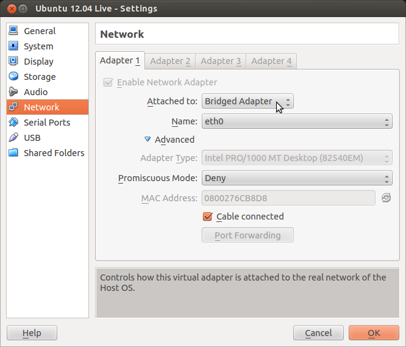
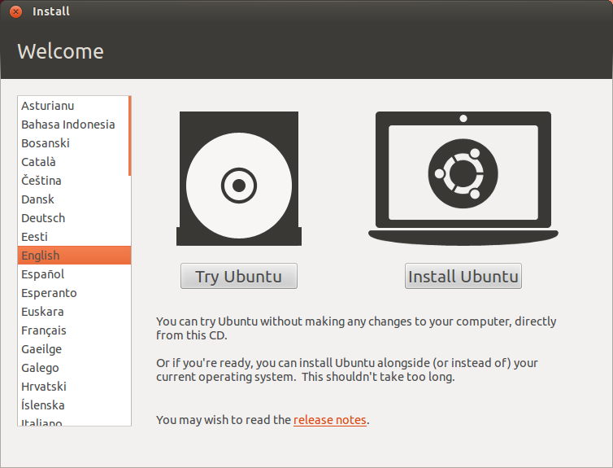
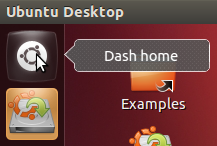
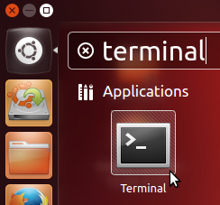
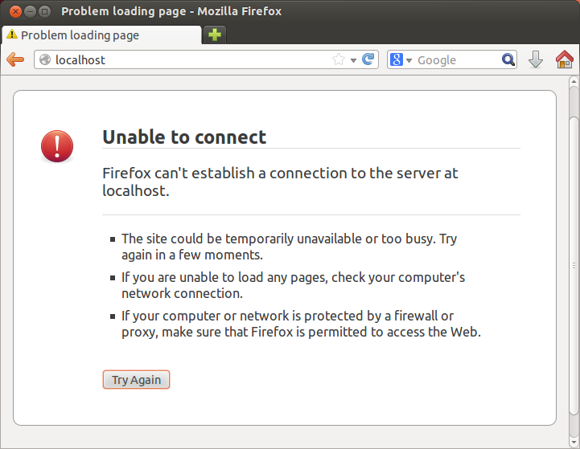
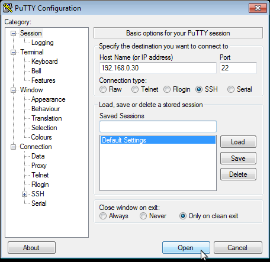
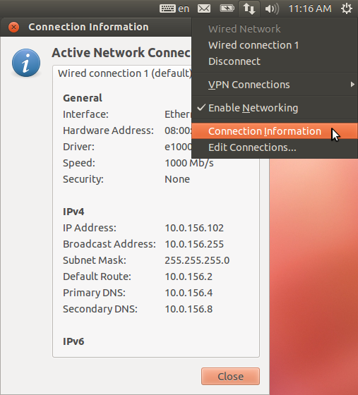

.. include:: <s5defs.txt>

.. include:: ../includes/Series.rst

Linux Familiarization and Commands (Exercises)
==============================================

Based on the `materials <http://www.ws.afnog.org/afnog2013/unix-intro/presos/commands-exercises.txt>`_
developed by NSRC for AfNOG 2013, and reused with thanks.

Adapted for the INASP Network Management training course by Chris Wilson
at Aptivate.

Objectives
----------

On completion of this session, we hope you will know about:

* Logging into a Unix system
* Normal users and root
* Using the ``bash`` shell
* Running commands
* Some basic commands
* Editing text files

Notes
-----

* Commands preceded with "$" imply that you should execute the command as
  a general user - not as root.
* Commands preceded with "#" imply that you should be working as root with
  "sudo"
* Commands with more specific command lines (e.g. "RTR-GW>" or "mysql>")
  imply that you are executing commands on remote equipment, or within
  another program.

Bridged Networking
------------------
  
Ensure that the virtual machine's network interface is configured in
Bridged mode, instead of NAT:

This ensures that your virtual machine has an IP address on the same network
as the physical machines, and you can connect to it over the network.
   
Boot up the virtual machine
---------------------------

We will boot Ubuntu Desktop (or a Live CD) as a virtual machine in VirtualBox.

Log into the Ubuntu desktop
---------------------------

If you installed Ubuntu, then you created a username and password already.

If you are using a Live CD, then you don't need to enter a username and
password. Just click on the **Try Ubuntu** button on the Welcome screen.

Open a terminal
---------------

The Terminal is like the Windows Command Prompt. It allows you to run
commands in a window on the graphical desktop.

Click on the **Dash Home** button, in the top left of the screen.
Type the word ``terminal``, and then click on the Terminal icon.

   
Become the root user
--------------------

At the command prompt type the following command::

   $ sudo -s

Enter your user account's password when prompted. (If you are using the
Live CD, there is no password and you won't be prompted for one).

Now that you are root the command prompt will change. We indicate this using
the ``#`` symbol.

You are now the super user - be careful!

Ok, exit the root account::

   # exit
   $

Look at the network configuration of your host
----------------------------------------------

"cat" is for "concatenate" and is one way to view what is in a file.
For example::

   $ cat /etc/network/interfaces

Notice that only the **loopback** interface ``lo`` is defined. The
other interface (the virtual Ethernet interface ``eth0``) is managed
by the Ubuntu Network Manager, a graphical tool.

List files
----------

Use ls to list files::

   $ cd           [go to your home directory]
   $ ls

Do you see anything? Try this instead::

   $ ls -lah 

What's inside one of these files? Try the following commands::

   $ cat .profile
   $ less .profile
   $ clear

Press the ``q`` key to exit the ``less`` program and return to the command
prompt.

If you don't understand what ``cat``, ``clear`` or ``less`` do, then use
the manual (``man``) command to access the online documentation::

   $ man cat
   $ man clear
   $ man less

Press the ``q`` key to exit the ``man`` program and return to the command
prompt.  
   
Working with the command prompt
-------------------------------

You can recall previous commands by using the up-arrow and down-arrow keys.
Give this a try now.

Alternately, try using the ``history`` command::

   $ history

If you wish to execute one of the commands in the list you saw type::

    $ !nn

Where ``nn`` is the number of the command in the history list. This is
useful if you want to run a past command that was long and/or complicated.

Command completion
------------------

With the bash shell you can auto-complete commands using the tab key.
This means, if you type part of a command, once you have a unique string
if you press the TAB key the command will complete. If you press the TAB
key twice you'll see all your available options. Your instructor will
demonstrate this, but give it a try by doing::

   $ hist<TAB>
   $ del<TAB><TAB>
   $ rm <TAB><TAB>      [Include the space after the 'rm']

Working with pipes
------------------

We saw an example of using pipes when we sorted the contents of our
``/sbin`` directory during the presentation. To write the sorted list of
files to a file, run::

   $ cd
   $ ls /sbin | sort > sbin.txt

Now view the contents of what is in sbin.txt to verify that this worked::

   $ less sbin.txt

Press the ``q`` key to exit the ``less`` program and return to the command
prompt.

Finding text strings
--------------------

Use the command grep to print lines matching a pattern in a data stream
(such as a file). For example, view the entry for your user account
(``ubuntu`` on the Ubuntu Live CD) in the system passwd file::

   $ sudo grep ubuntu /etc/passwd

You should see something like::

   sysadm:x:1000:1000:System Administrator,,,:/home/sysadm:/bin/bash

This line is split into **fields**, separated by the colon character, ``:``::

   userid:passwd:uid:gid:Name,extrastuff,,:HomeDir:LoginShell

grep is often used with a pipe to FILTER the output of commands. For instance::

   $ history | grep ls

Will display the ``ls`` commands that you ran earlier.

Opening a web browser
---------------------

Click on the Firefox icon (globe and fox) on the Launcher bar:

Try browsing to ``localhost``. What happens?

Why? Because there's no web server installed on the virtual machine.
   
Installing software
-------------------

To install the Apache web server on our virtual machine, switch back
to the Terminal and use the ``apt-get`` command::

   $ sudo apt-get update
   $ sudo apt-get install apache2

The ``apt-get update`` command downloads the latest list of packages from
the Ubuntu servers. Otherwise the machine may try to download an old version
of a package, that's been removed from Ubuntu's servers.
   
What is the ``sudo`` command? It runs one command (in this case ``apt-get``)
as the ``root`` user. It allows you to stay running as a normal user most of
the time, and quickly run commands as ``root`` when necessary. This is safer
because it makes you think before you do something that might damage your
computer.

Now what happens when you browse to ``localhost``?

Stopping and starting a service
-------------------------------

In the web browser (on the virtual machine) go to your machine's home page::

   http://localhost/

You should see something like "It Works!" on the page. Now, let's stop the
web server (Apache) that is installed on your virtual machine::

   $ sudo service apache2 stop

Now reload the web page for your machine. It should indicate that no web
server was found. Now let's start the service again::

   $ sudo service apache2 start

You can see if a service is running by typing::

   $ sudo service apache2 status

If a process ID is displayed, then the service is running, but our next
exercise will show you another way to verify this.

Connecting to your virtual machine using SSH
--------------------------------------------

If your laptop runs Windows, you need to download an SSH client. A good
choice is `Putty <http://www.chiark.greenend.org.uk/~sgtatham/putty/>`_,
which you can download `here <http://the.earth.li/~sgtatham/putty/latest/x86/putty.exe>`_.
Your facilitator may have downloaded a copy to a local server. When you
run it, you'll be asked which server to connect to:

If your laptop runs Linux or MacOS X, then you almost certainly have an
ssh client installed already, as the ``ssh`` command.

Ensure that you have the SSH server installed on your virtual machine::

   $ sudo apt-get install openssh-server
   
Check the IP address of your virtual machine::

   $ /sbin/ifconfig
   
You can also use Network Manager to get details of the network connection,
including the IP address:

If you're using the Live CD, the ``ubuntu`` account has no password, so you
can't log in using SSH until you set a password for it::

   $ passwd
   
Now try to connect to your virtual machine. Use the username of the account
that you created during installation, or ``ubuntu`` if you're using the
Live CD. For example, from a MacOS X or Linux Terminal, run::

   $ ssh ubuntu@192.168.0.30

If this doesn't work, it may be due to a
`bug <https://bugs.launchpad.net/ubuntu/+source/linux/+bug/882147>`_ in the 
Ubuntu 12.04.3 Live CD, which you can work around by running the following
commands on your virtual machine::
   
   $ sudo initctl reload-configuration
   $ sudo start ssh
   
Finding and stopping processes
------------------------------

If you wish to find something that is running and then stop it you can use
the ``ps`` (processes) command with ``grep`` and ``kill``. Let's do this by
opening two connections to your virtual machine.

a. Using SSH open two terminal connections to your Linux server
b. One you have opened two terminals go in to one terminal and type::

   $ tail -f /var/log/syslog

This will let you look at the end of the syslog log file in real time. If
events take place that are logged you will see them as they happen. Now, in
your other terminal let's look for this process::

   $ ps auxwww | grep tail

The "auxwww" are options to the ps (process) command. The options mean
display all process running that belong to you and to other users and
provide information about who owns what process. The three "www"'s mean
display the entire command line regardless of how long it is, and wrap it
in your window. (The ``ps`` command has unusual options that don't start
with dashes, for obscure historical reasons.)

You will likely see something like this::

   root      6903  0.0  0.0   7200   612 pts/0    S+   03:28   0:00 tail -f /var/log/syslog
   root      6986  0.0  0.0   9388   924 pts/1    S+   03:28   0:00 grep --color=auto tail

Note that your ``grep`` command also shows up in this list, because it
includes the word ``tail`` in its command line. You want to kill the ``tail``
command, not the ``grep`` command!
   
You could press "CTRL-C" in the terminal window where the tail command is
running, or to stop the process from a different terminal you can use the
``kill`` command.

You need to replace the Process ID (PID) with the process ID number of the
``tail`` command running on your machine. In this example the number is
"6903": the second column of the line describing the ``tail`` process
that you want to kill. At the command prompt type::

   $ kill NNNN

Where NNNN is the PID of your tail process. Once you do this return to the
other terminal screen. The "tail -f" process should now have exited and you
should see something like::

   Terminated
   ubuntu@ubuntu:~$

End of first set of exercises
-----------------------------

Any questions?
