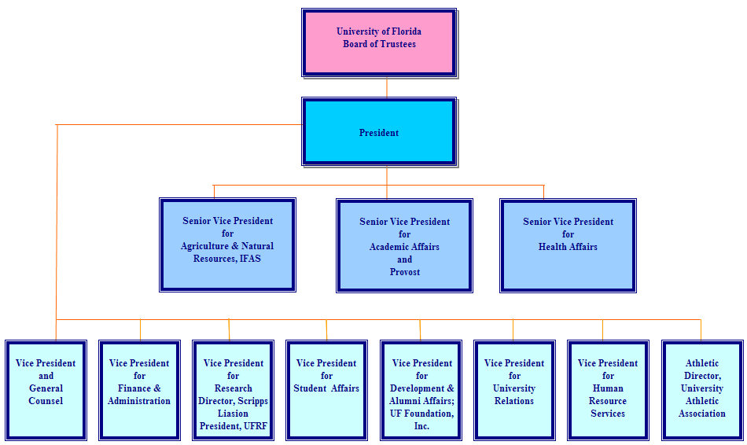
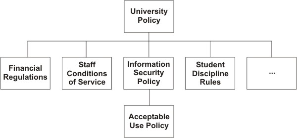
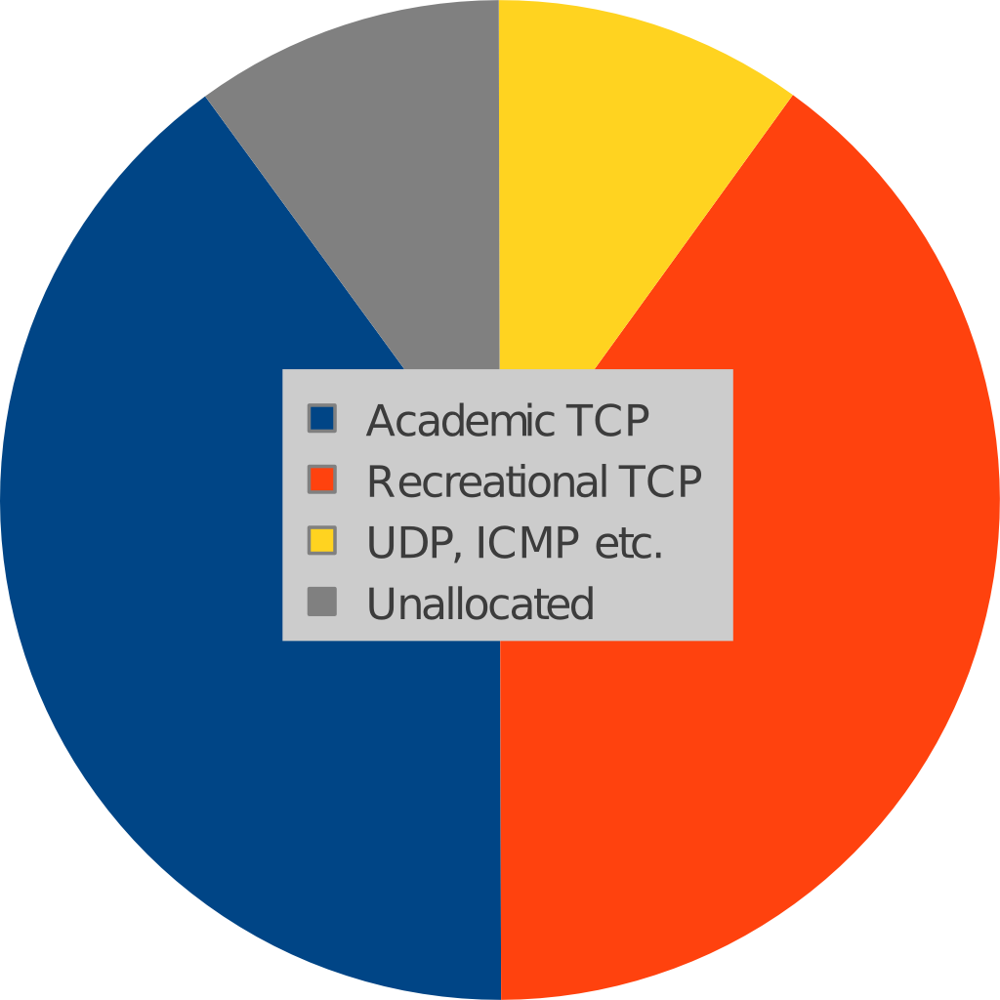

What makes a good policy?
=========================

Objectives
----------

* Review the characteristics of good policy.
* Assess the degree to which the policy documents of participating institutions/other institutions meet the definition of good policy.
* Consider ways in which the policy documents can be improved.

What is policy, anyway?
-----------------------

* Cognate terms: polis, police, political (with a small “p”)
* Who owns policy?
* How is it different from strategy?
* How is it different from regulations?

Example organisation structure
------------------------------

Note how the policy structure mirrors the organisation structure:

Authority is delegated down the tree, to write the rules governing some
aspect of users' behaviour and interactions within the organisation.

Characteristics of good policy
------------------------------

* has an enabling purpose
* linked to a wider objective
* has clear ownership
* is clear and short
* managed by a process
* confined by a defined authority
* is enforced
* is adaptable

Good policy has an enabling purpose
-----------------------------------

* Policy is not just a set of restrictions. 
* It is a set of restrictions with a purpose:
  * to make things possible
* It encourages and enables users, it is not just a list of do's and don'ts

Good policy is linked to a wider objective
------------------------------------------

* Why have the policy (at an institutional level)?
  * Why should I support this policy?
  * Be prepared for this question and be able to answer it
* The only way to win support for the policy
  * Rather than reluctant acceptance

Good policy has clear ownership
-------------------------------

* Who owns the policy?
  * Is this clear from the policy document?
* Is it the "right" ownership to ensure support and buy in?
* It should not be the IT department
  * Imagine your plumbers making rules about what you can or can't use your pipes for?
* It should generally be the highest authority in the institution that there is

.. class:: handout

Your plumber is providing a service to you, for a fee. They don't own your
pipes. You do, and you're entitled to use them how you want. But you don't
flush poisons or machine oil down them, because that would be breaking the
law.

Similarly, the IT department doesn't own the Internet connection. It belongs
to the unversity/organisation, and exists for the benefit of all, not just the
IT department.

Good policy is clear and short
------------------------------

If we want it to be a live and useful document, then it should be:

* Clear and well written; no technical or legal jargon
* Short; easily read and digested by end users

You can have two versions if you really insist (one for all users to read
and understand, and a supporting, full “legal” document) but not
recommended! Just make one, short, simple, non-legal document.

Good policy arises from a process
---------------------------------

* Processes are what secure buy-in and a sense of ownership
* Both essential for successful policy development and implementation
* Consensus is the process most likely to persuade all users
  * But the hardest to implement, for the same reason.
* Policy should not be static either!
  * Respond to changing needs of users.
  * The process needs to enable this, for example users propose amendments
  and they are voted on by a board.

Good policy is confined by a defined authority
----------------------------------------------

Good policy works within the confines of a defined authority, for example:

	The IT department is authorised to restrict or suspend the
	access of some users, for limited time, to maintain the health of
	the IT services for other users.

Good policy is enforced
-----------------------

Good policy is adaptable
------------------------

Finding the Policy
------------------

* What is the Acceptable Use Policy (AUP) for your network? Where is it?

* Ask someone who uses your network to outline the policy from memory.
  Compare it with the real policy.

* Ask someone to find a copy of it, and watch them try.

.. class:: handout

Consider how well your users understand your policy. Test them.
Test the next person you see: is action X allowed by the policy or not?

How is your policy enforced, by who, and how well? Who follows the policy,
who fights against it? How could you get them on side?

It's been said that "5% of users use 50% of the traffic, so 95% should be
on your side." Do you agree? How many people abuse your network or cause
problems for you? Do the others understand the problem and the benefits
of reasonable, fair use? If not, how would you show them?

Who is responsible?
-------------------

Who needs to be involved in network management, and why?

* Executive management
* Senior IT management
* Technical staff involved in the day-to-day implementation
* Academics, librarians and other legitimate Internet users

.. class:: handout

What roles do they play in managing a network?

Executive management
	have the power to create or change policy and budgets.
Senior IT management
	bridge the gap between staff on the ground, executives and the rest
	of the university.
Technical staff
	have the skills to understand the problem, implement changes, and
	identify policy violations.
Legitimate Internet users
	are the reason why the University pays so much for its Internet
	connection and the IT department. They are your customers!

Outline of a plan
-----------------

* Simple overall aim
  * One to Three simple specific objectives
  * Simpler is safer (K I S S)
* An objective must be specific and measurable
* Justification
  * improving effectiveness
  * return on spend/investment
* Consequences
  * Of doing or not doing
* How do you manage risks during implementation
  * Go/No Go gates
* How will you monitor and review
  * Regular milestones
* Who are the key people (stakeholders)
* Timetable

Fair Deal
---------

* Everyone gets 1 Mbps, without exception
* Pros:
  * Easy to implement
  * No policing required
* Cons:
  * Network resource will be under-used
  * Conversely, if everyone uses their 1 Mbps then capacity will be exceeded
  * Important work-related downloads may be slowed

Punish repeat offenders
-----------------------

* Heavy users:
  * Those who transfer over 650MB/day off-campus are placed in heavy-user bucket
  * Heavy-users get limited bandwidth (e.g. 1.5Mbps aggregate)
  * Further reduction for repeat offenders
* Pros:
  * Heavy users get amplified negative feedback
  * No deep packet inspection required
* Cons:
  * Network resource will be under-used
  * Important work-related downloads may be slowed
  * Arbitrary limits are difficult to justify

Nuisance applications
---------------------

* Define list of "nuisance" apps and identify their traffic
* All nuisance app traffic goes into a fixed bucket (e.g. 10 Mbps)
* Pros:
  * Low maintenance
  * Nuisance app users get amplified negative feedback
* Cons:
  * What is a nuisance app? How to identify it?
  * Users will discover new ways to abuse bandwidth
  * Requires a bandwidth manager with deep packet inspection

Protocol mix
------------

* Academic TCP and Recreational TCP are "equal"
  * 40% each for Academic and Residential TCP
* Non-TCP and TCP don’t necessarily play well together
  * 10% for non-TCP
* Leave 10% unallocated (burst, control plane)
* Possible add-ons
  * Individual flow or user policing
  * Priority queuing
* Pros:
  * Low maintenance
  * Recreational users get amplified negative feedback
* Cons:
  * How to identify academic/recreational traffic?
  * Requires a bandwidth manager with deep packet inspection
  * Is 10% enough for VoIP applications and VPNs?

