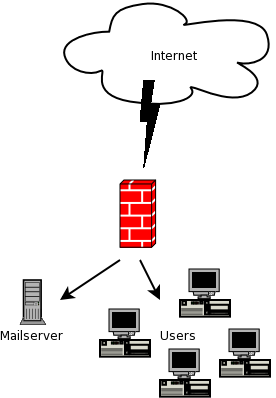

.. include:: <s5defs.txt>

.. include:: ../includes/Series.rst

Unit 11: Technical Measures (Exercises)
============================================

.. include:: ../includes/Authors.rst

Objectives
----------

On completion of this session, we hope you will know about:

* TODO

Your Setup
----------

Exercise 1: Installation
------------------------

Using the notes provided, install BWM Tools

TODO: do we have the notes?

Exercise 2: Basic Shaping
-------------------------

You have a 128Kbps pipe into the internet, your users browse normal
websites extensively to do research. Recently users friends have been
distributing large movie clips by email which is pulling your line
down. Users are complaining they cannot work.

1. Give web browsing (port 80) priority over email (port 25)
2. Limit email traffic to 32Kbps and allow bursting to 64Kbps if
   bandwidth is available
3. Use bwm_monitor to see if everything is working

Exercise 3: Reporting & Graphing
--------------------------------

The financial director has asked you to provide him with a report of
how much bandwidth is being used by email and to compare it to the
legitimate browsing traffic.

1. Setup reporting for the flows you created in Exercise 2. (one can
   use 10s reporting intervals for a duration of 5 minutes)
2. Generate a graph for the two flows, including the total usage for
   the reporting period

Exercise 4: Firewalling
-----------------------

You've noticed a user using port 4000 to listen to a local radio station
that streams their shows over the internet. This streaming requires
64kbps. You've discussed the situation with your boss and he's told
you to block it.

1. Reject all outgoing connections to port 4000
2. Use IPTables to verify everything is working

Exercise 5: Challenge
---------------------

Your internet pipe has been upgraded to 512kbps (512k down, 256k
up). You've been asked to implement bandwidth control and
prioritization and to provide reports to the financial director. Your
new internet pipe is a DSL line and only has one static IP.

1. Shape both incoming and outgoing traffic separately
2. Prioritize DNS traffic and browsing traffic
3. Limit the sending of mail by your mailserver to burst to 256Kbps
   and incoming mail to your mailserver to burst to 128Kbps
4. Add a reporting group for combined mail in and out traffic
5. Implement network address translation
6. Forward all incoming connections on port 25 to your mailserver
7. Implement a simple statefull firewalling
8. Allow your box unrestricted access to the internet
9. Reject all other traffic
#. Generate 3 reports, one showing the total line utilization
   inbound including browsing and mail traffic, the second the
   total line utilization outbound including browsing and mail
   traffic and the third combined mail in and out traffic.
