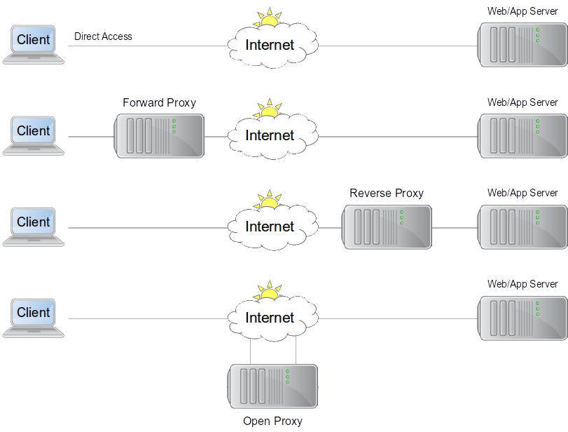
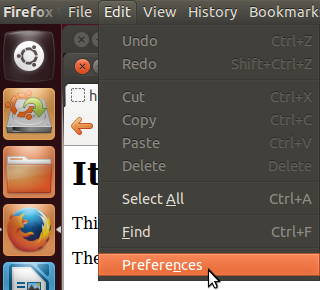
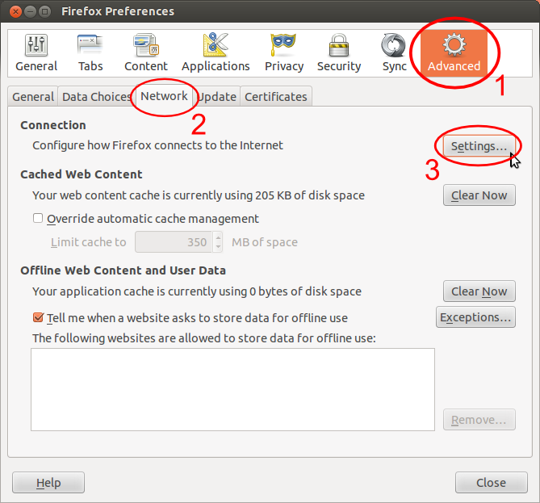
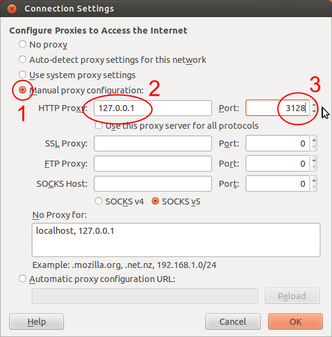
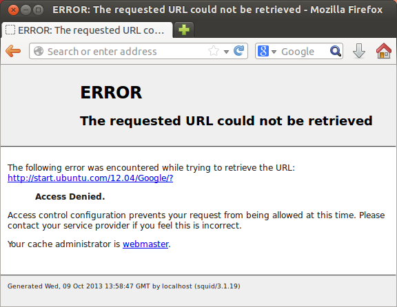
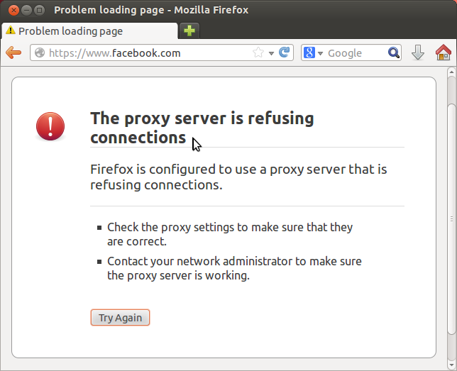
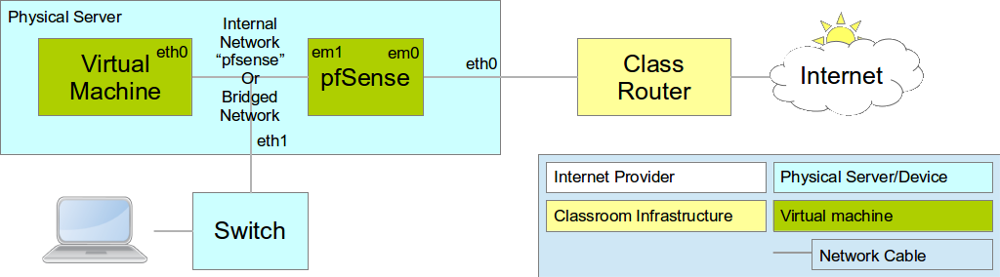
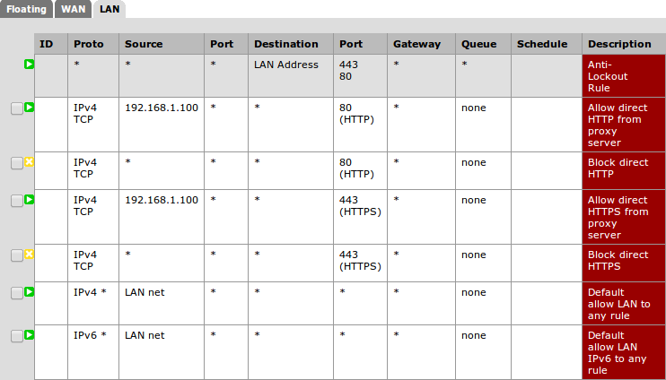
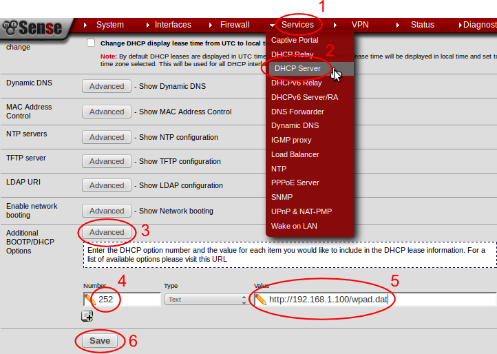
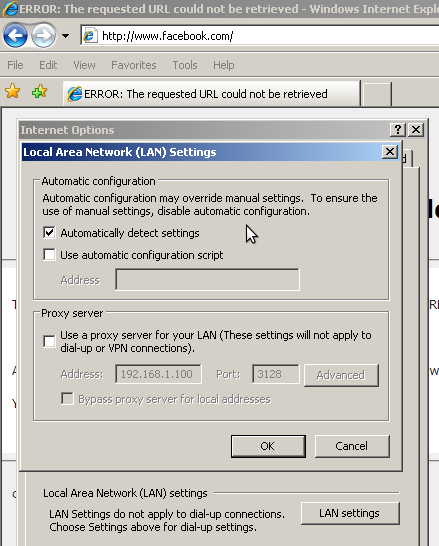

Web Proxies and Caches
----------------------

Some materials reused under the Creative Commons
`Attribution-NonCommercial-ShareAlike 2.5 <http://creativecommons.org/licenses/by-nc-sa/2.5/>`_
license:

*	the Web Caching manual, by Richard Stubbs of TENET;
*	the `BMO Book <http://bwmo.net/>`_, by various authors;
*	the `Squid Cache Wiki <http://wiki.squid-cache.org/>`_, by Amos Jeffries
	and other.

What is a web proxy?
~~~~~~~~~~~~~~~~~~~~

A proxy is a person or thing that acts on behalf of another person or thing.

A web proxy fetches web pages "on your behalf". So when you want to access
a particular page, instead of requesting it directly, you ask the proxy
to request it for you.

Forward and Reverse Proxies
~~~~~~~~~~~~~~~~~~~~~~~~~~~

Forward proxy
	Operated by the client's organisation, used by specific clients to
	connect to (usually) all web sites (servers).
Reverse proxy
	Operated by the server's organisation, used by (usually) all clients to
	connect to specific web sites (servers).
Open proxy
	Usually operated by a third parts, used by any client to connect to
	any web server, potentially dangerous/exploitable.

Why use web proxies?
~~~~~~~~~~~~~~~~~~~~

This allows the proxy to:

* Require you to log in and authenticate yourself to the proxy.
* Log the web page that you requested.
* Block access to the web page.
* Scan the content for viruses.
* Scan the content for obscenities or banned content.
* Serve a local cached copy of the content.

All of these things can be desirable in an institutional environment,
depending on how strict you want to be in denying or logging web accesses.

For users
	They can filter out viruses and other dangeous content. Users may also
	be forbidden from directly accessing the Internet by site policy, and
	must therefore use a proxy for all web requests.

For administrators
	They allow authenticating users, logging and inspecting the content
	of requests, associating a user account with a request, and filtering
	out dangerous or banned content. As reverse proxies, they can 
	`share public IP addresses between multiple independent applications <https://www.mediawiki.org/wiki/Wikimedia_Labs/Reverse_proxy_for_web_services>`_.
	
	Some reverse proxies are more efficient at serving static content than
	most web servers and application servers. You might need to run Apache
	to host your application, but
	`Squid <http://meta.wikimedia.org/wiki/Wikimedia_servers#System_architecture>`_,
	`Nginx <http://www.cyberciti.biz/tips/using-nginx-as-reverse-proxy.html>`_ or
	`Lighttpd <https://wiki.diasporafoundation.org/Lighttpd_reverse_proxy>`_
	would intercept requests for static content, reducing the load on the
	application server.

What is a web cache?
~~~~~~~~~~~~~~~~~~~~

The term cache literally means to store. In computing terms caching is the act of storing information on a local system, where the act of retrieving the information from the local cache is less than the cost of retrieving the information from the original source.

A web cache is a proxy that can cache copies of downloaded pages and files,
and serve them automatically, following the rules for caching HTTP requests.
This is very important because it ensures that the cache doesn't serve stale
content, which could break web applications.

Why use web caches?
~~~~~~~~~~~~~~~~~~~

For users
	They can return returns faster than accessing the Internet, if the
	requested document is already cached.

For administrators
	Web caches can reduce your inbound bandwidth needs by up to 40% of
	your web traffic.

Why not to use web caches?
~~~~~~~~~~~~~~~~~~~~~~~~~~

AKA: limitations of web caches

Not transparent
~~~~~~~~~~~~~~~

Each computer needs to be configured to use the proxy (or you need
to use network tricks such as PAC or interception, described later).

Effectiveness is falling
~~~~~~~~~~~~~~~~~~~~~~~~

More and more content is dynamic (not cacheable) and/or served over SSL.
Proxies add overhead to requests for dynamic content, and usually can't
intercept SSL connections as that would invalidate the security certificate
on the connection.

Hardware requirements
~~~~~~~~~~~~~~~~~~~~~

A web cache requires a fairly fast server with a lot of disk space to be
effective:

*	Limit the number of simultaneous web requests from all users to the
	capacity of the proxy/cache (usually 50-100 for Squid).
*	Slower CPUs will add more overhead to each request.
*	Need enough disk space to be effective, otherwise the cache hit rate
	will fall, so more requests are slowed down and fewer are accelerated.
*	Need enough RAM for OS to cache commonly used cache objects and
	directories, otherwise the disk accesses will add overhead to every
	request.

Note: reverse proxies for static content perform much better than Squid,
if the static files are accessible to the proxy via a shared filesystem.

Single point of failure
~~~~~~~~~~~~~~~~~~~~~~~

If all web requests pass through a single server, then if that server fails,
all web requests will fail.

Proxies are good candidates for replication and load balancing, as they
are usually stateless (apart from the cache, but that only affects
performance).

However, Squid's high hardware requirements make it expensive to replicate
if you have a busy network.

Getting started with Squid
--------------------------

Basic installation
~~~~~~~~~~~~~~~~~~

To install Squid on an Ubuntu or Debian system::

	$ sudo apt-get install squid3
	$ service squid3 status

If you're using the Ubuntu 12.04 Live CD, it may fail to start due to a
`bug <https://bugs.launchpad.net/ubuntu/+source/linux/+bug/882147>`_ in the 
Ubuntu 12.04.3 Live CD. Then you need to run these commands::
	
	$ sudo initctl reload-configuration
	$ sudo start squid3

Configuring your browser
~~~~~~~~~~~~~~~~~~~~~~~~

Reconfigure your web browser to use the proxy.

.. class:: handout

In Firefox for example, go to Edit/Preferences:

Then go to the Advanced tab, under that choose Network, and click on the
Connection/Settings button:
	

*	Choose *Manual proxy configuration*;
*	For *HTTP proxy* enter ``127.0.0.1``, assuming that you want to connect
	to Squid running on the same host;
*	For *Port* enter ``3128``, the default port for Squid.

Testing the installation
~~~~~~~~~~~~~~~~~~~~~~~~
	
Now try to access a website in the browser. What happens?

How can you tell if you're using the proxy? Look at the logs::

	$ sudo tail /var/log/squid3/access.logging

.. class:: handout

You should see your IP address, the URL accessed, page size, etc. You'll
also see a separate request line for any image included by the page.

Access control by IP address
~~~~~~~~~~~~~~~~~~~~~~~~~~~~

Try to configure a different computer to access your proxy server, for
example your laptop. What happens?

What caused the *Access Denied* error? We need to find out how Squid access
control works. It's defined in the Squid configuration file,
``/etc/squid3/squid.conf``, by the following lines::

	acl localhost src 127.0.0.1/32 ::1
	# acl localnet src 10.0.0.0/8    # RFC1918 possible internal network
	# http_access allow localnet
	http_access allow localhost
	http_access deny all

What does this mean?

.. class:: handout

acl localhost src 127.0.0.1/32 ::1
	This ACL condition is true if the request's source (i.e. the client's
	IP address) is either ``127.0.0.1`` or ``::1``.
	
# acl localnet src 10.0.0.0/8
	This is a commented-out example of an ACL condition called ``localnet``
	(**local network**), which would be true if the client's IP address was
	in the subnet 10.0.0.0/8.

# http_access allow localnet
	This is a commented-out example of an ACL rule that allows HTTP access
	(clients connecting to port 3128) to any host where the ``localnet``
	ACL condition is true.
	
http_access allow localhost
	This is a real ACL rule that allows HTTP access to any host where the
	``localhost`` ACL condition is true.

http_access deny all
	This ACL rule denies HTTP access to anyone else. It always matches, but
	rules are applied in order, so the ``http_access allow localhost``
	rule applies first.

Why do you deny me?
~~~~~~~~~~~~~~~~~~~
	
Questions:

*	What IP address did we try to access the cache from?
*	If you don't know, how would you find out?
*	Is it allowed or denied by the rules? Which rule in particular?
*	How would you change it? What would you have to add?

.. class:: handout

If you don't know the client's IP address, have a look at the logs.

Reading the logs
~~~~~~~~~~~~~~~~

Here is an example line from the Squid log file:

	1381327552.088 0 **10.0.156.126** TCP_DENIED/403 4425 POST http://safebrowsing.clients.google.com/safebrowsing/downloads? - NONE/- text/html

The IP address is the third field on the line, **10.0.156.126** in this case.

What are the other fields?

.. class:: handout

1381327552.088
	This is the time of the log entry, in Unix timestamp format.
	Unambiguous, but hard to read. You can convert it on the command line::
	
	   date --date '@1381327552'
	   Wed Oct  9 14:05:52 UTC 2013
	
0
	Duration, or elapsed time. How long it took to process the request, and
	return a response, in milliseconds.
10.0.156.126
	The IP address of the requesting instance, the client IP address. The
	client_netmask configuration option can distort the clients for data
	protection reasons, but it makes analysis more difficult.
TCP_DENIED/403
	This column is made up of two entries separated by a slash:
	the cache result (``TCP_DENIED``) and the HTTP status code returned to
	the client (``403``).
4425
	The length of the response sent to the client, in bytes.
POST
	The HTTP *method* requested by the client. Usually this is ``GET``
	to retrieve a web page or image, and ``POST`` when submitting a form.
	See the HTTP standard
	(`RFC 2616 <http://www.w3.org/Protocols/rfc2616/rfc2616.html>`_) for
	more details.
http://safebrowsing.clients.google.com/safebrowsing/downloads?
	The URL requested by the client.
-
	The *ident lookup* result. Usually this is useless and turned off.
NONE/-
	The *hierarchy code*, which consists of three items: the optional
	prefix ``TIMEOUT``; A code that explains how the request was handled,
	e.g. by forwarding it to a peer, or going straight to the source;
	and the IP address or hostname where the request (if a miss) was forwarded
	to, which might be the origin server, or a neighbor cache.
text/html
	The *MIME type* of the response, which usually indicates whether it
	is a web page, an image, a downloadable executable file, etc. This is
	sent by the origin server, not determined by Squid, and is not guaranteed
	to be correct.

Thanks to Amos Jeffries for writing the
`Squid Wiki LogFormat page <http://wiki.squid-cache.org/Features/LogFormat>`_
where this information was found.
	
Don't deny me!
~~~~~~~~~~~~~~

How do we change the access control configuration, to allow connections
from a different IP address?

Add the following lines to the Squid configuration file::

	acl localnet1 src 10.0.156.0/24
	http_access allow localnet1

Note that:

*	The ACL name must be unique. It should also be descriptive. Don't call
	all your local networks ``localnet`` or ``localnet1``.
*	These lines **must** appear before ``http_access deny all``. (Why?)
*	It's probably safest, and easier to read the configuration file, if you
	keep all of your own ACL configuration lines between
	``http_access allow localhost`` and ``http_access deny all``.

Reloading and restarting Squid
~~~~~~~~~~~~~~~~~~~~~~~~~~~~~~
	
What happens when you change the configuration? Does it automatically take
effect?

No. Squid doesn't reload its configuration file automatically. You need to
restart it::

	$ sudo restart squid3
	
Or tell it to reload its configuration::

	$ sudo /etc/init.d/squid3 reload
	or
	$ sudo squid3 -k reconfigure

Restarting is slow, because it waits for open connections to finish. No
requests are serviced during this time, so web access is impossible. The
``reload`` and ``reconfigure`` commands (which do the same thing) don't
cause any downtime for the service, and don't clear the in-memory caches
(``cache_mem`` and the DNS cache), so they are usually a better choice.

However, if you enable ``cache_dir`` then Squid needs to shut down and
restart in order to initialize it. Just a ``reload`` isn't enough, and it
won't cache anything on disk until you ``restart`` it.

Reverse proxies and open proxies
~~~~~~~~~~~~~~~~~~~~~~~~~~~~~~~~

Why not just allow everyone? Like this::

	acl everyone src 0.0.0.0/24
	http_access allow everyone
	http_access allow all

Because this would create an open proxy, which is bad because:

*	People outside the organisation can waste your bandwidth.
*	They can also conduct illegal activities using your proxy, and the
	police will come knocking on your door instead of theirs.
*	Spammers often use open proxies to send spam.
*	As a result, some realtime blacklists (RBLs) scan for open proxies
	and when they find one, they add its IP address to their blacklist.

.. class:: handout

So every proxy should do one of the following:

Forward proxy
	Restrict access to certain source IP addresses
Reverse proxy
	Restrict access to certain destination domains (with the ``acl dstdomain``).

Further configuration of reverse proxies is out of scope of this tutorial,
but you can find more details
`on the Squid Cache wiki <http://wiki.squid-cache.org/SquidFaq/ReverseProxy>`_.

Cache Size
----------

The cache size determines the hit rate (bandwidth and time saving) of
the Squid proxy server, trading off against disk space and memory usage.

Making the caches too large for the system can result in complete failure
of the proxy server, starvation of resources from other applications on the
same server, and eventually swap death of the server.

Disk cache size
~~~~~~~~~~~~~~~

The default configuration on Ubuntu contains the following::

	#cache_dir ufs /var/spool/squid3 100 16 256

How big is the default disk cache size? Do we want to change it?
	
.. class:: handout

There is NO uncommented ``cache_dir`` by default, so there is
**no disk cache**. There is however a memory cache of 256 MB::

	cache_mem 256 MB
	
(This is the default unless an uncommented ``cache_mem`` line is found
in the file, which there isn't in the default Ubuntu configuration.)

The ``100`` in the above configuration means that the cache would be
100 MB, if it was enabled. A more useful cache size would be 10-100 GB,
so you could uncomment this line and change it to::

	cache_dir ufs /var/spool/squid3 10000 16 256

Note that this will place the cache in the directory ``/var/spool/squid3``.
This filesystem must not fill up, otherwise the cache will stop working,
and nobody will be able to browse the web! Make sure that you don't allow
the cache to grow larger than the free space on the filesystem, which
you can tell with the ``df`` command.

Also, leave enough space for anything else using the same filesystem,
so that it doesn't fill up. Log files, mailboxes and SQL databases usually
live under ``/var``, and if you don't have a separate filesystem for them,
``/home`` and ``/tmp`` will also take space away from the Squid cache.

Memory usage
~~~~~~~~~~~~

Memory that will be used by Squid:

*	about 10 MB of RAM per GB of cache specified by your ``cache_dir`` directive;
*	plus the amount specified by the ``cache_mem`` directive;
*	plus another 20 MB for additional overhead.

You need to ensure that there's enough memory left for the OS and its
block cache.

.. class:: handout

For example, if you set ``cache_dir`` to 10000 (10 GB) and leave
``cache_mem`` set to the default 256 MB, then Squid will use approximately
100 + 256 + 20 = 376 MB.

If this is more than half the RAM in your cache server, then reduce either
the ``cache_dir`` or ``cache_mem``, or add more memory to the cache server.

Squid Access Control
--------------------

Access control determines which requests are allowed or denied by the
Squid proxy server. It also determines which requests are routed into which
delay pools (bandwidth limits).

Access control elements
~~~~~~~~~~~~~~~~~~~~~~~

Every line in the configuration file that starts with ``acl`` is an
Access Control Element (ACE). These are reusable sets of conditions:

*	You can use them in as many rules as you like,
*	and combine them with each other in rules.

Every ACE must be *defined*, which gives it a unique *name*. The 
definition looks like this:

	``acl`` <name> <type> <values>

ACE types
~~~~~~~~~

The *type* determines what kinds of *values* are appropriate:

============= ================================================= ==========================================
ACL type      Values                                            Example
============= ================================================= ==========================================
src           source (client) IP addresses or CIDR ranges       10.0.156.1, 10.0.156.0/24, 2001::dead:beef
dst           destination (server) IP addresses or CIDR ranges  10.0.156.1, 10.0.156.0/24, 2001::dead:beef
dstdomain     destination (server) domain name, exact/prefix    ``www.facebook.com``, ``.facebook.com``
dstdom_regex  destination (server) regular expression pattern   ``\.facebook\..*``
maxconn <N>   client IP address has more than N TCP connections ``10``
proto         the protocol part of the requested URL            HTTP, FTP
time          days (SMTWHFA) and time range (h1:m1-h2:m2)       ``19:00-23:59``, ``MTWHF 08:00-18:00``
url_regex     regular expression match on requested URL         ``sex``, ``iso``, ``mp3``
browser [-i]  pattern match on User-Agent header                ``-i MSIE 6.1``
============= ================================================= ==========================================

The ``srcdomain`` ACE: a special case
~~~~~~~~~~~~~~~~~~~~~~~~~~~~~~~~~~~~~

If you block ``.microsoft.com``, does it block ``microsoft.com`` as well
as ``www.microsoft.com``? Why?

.. class:: handout

Answer: Yes it does, because of a specific exception in the Squid source
code. Many websites are accessible with and without the ``www`` subdomain,
by convention, and it would be annoying to have to specify every domain
twice, with and without the initial dot ``.``, to match both of them.

ACEs with multiple values
~~~~~~~~~~~~~~~~~~~~~~~~~

The values are combined using ``OR`` logic. If any value matches, the
whole ACE matches. So it's valid to include mutually exclusive values
on the same ACE::

	acl mynetworks src 192.168.1.0/24 192.168.3.0/24
	acl updates dstdomain .microsoft.com .adobe.com

What happens if you specify overlapping domains? For example::

	acl updates dstdomain .microsoft.com .download.microsoft.com
	
.. class:: handout

Access control rules
~~~~~~~~~~~~~~~~~~~~

Rules look like this::

	http_access         allow <ace name> <ace name>
	http_access         deny  <ace name> <ace name>
	delay_access <pool> allow <ace name> <ace-name>

There are several different types of rules, all ending with ``_access``:

http_access
	Control whether a client is allowed to make a particular request through
	the HTTP port (3128)
icp_access
	Control whether a cache peer is allowed to make a particular request
	through the ICP port. Could this be abused, and how?
cache_peer_access
	Control which requests will be sent to a particular cache peer.
	This type of rule needs a parameter; why?
delay_access
	Control which requests will be sent to a particular delay pool.
	This type of rule needs a parameter; why?
snmp_access
	Control access to the built-in SNMP server (need to recompile Squid
	on Debian and Ubuntu to use this).
	
Rules with multiple ACEs
~~~~~~~~~~~~~~~~~~~~~~~~

The ACEs on an access control rule are combined using ``AND`` logic.
All the ACEs must be true, otherwise the rule will be ignored for that
request.

Rules are processed in order, and the first matching rule (where all the
ACEs are true) of a particular type determines what happens for that
rule type.

Examples:

*	The first matching ``http_access`` rule determines whether an HTTP
	request is allowed or denied.
*	The first matching ``cache_peer_access`` rule determines whether the
	request is sent to a peer cache, and which one.
*	The first matching ``delay_access`` rule determines whether the request
	is sent to a delay pool, and which one.
	
Rule processing examples
~~~~~~~~~~~~~~~~~~~~~~~~

Which hosts and domains are allowed, which are denied, and which are sent
to a peer cache in the following configuration?

	acl microsoft dstdomain .microsoft.com
	acl wireless src 10.0.158.0/24
	http_access allow all
	http_access deny wireless
	cache_peer_access updates allow microsoft
	cache_peer_access updates deny all

Access control practice
~~~~~~~~~~~~~~~~~~~~~~~

Try blocking the following, and get someone else to check your work:

*	a particular client IP address
*	the subnet that your client is on
*	a subnet that your client is NOT on
*	www.facebook.com
	*  except for one client IP address
	*  and try to evade the ban
	*  did you just block ``http://www.bing.com/search?q=facebook`` as well?
	*  how would you do that?
*	any website with ``sex`` in the URL
*	did you just block ``http://www.essex.ac.uk/``?
*	more than 2 connections per client IP address (how would you test it?)
*	FTP downloads from ``ftp://www.mirrorservice.org/``

Remember to follow a good, thorough process for each exercise:

*	decide beforehand how you will test for success;
*	check that your request is not already blocked;
*	make the change to implement the block;
*	check that it behaves as you expected;
*	undo the change before moving on to the next;
*	check that the request is allowed again.

Otherwise you might think that you succeeded, when actually the request
was blocked by some previous configuration that you didn't undo successfully.

.. class:: handout

Be careful if you test using a site that automatically redirects you to
SSL, such as ``www.google.com`` or ``www.duckduckgo.com``, as this will
bypass the cache without you realising! You can test with ``www.bing.com``
as it doesn't do that at the time of writing (2013-10-09).

Solutions to block:

*	a particular client IP address::
	acl bad_boy src 10.0.156.126
	http_access deny bad_boy
*	the subnet that your client is on::
	acl bad_boys src 10.0.156.0/24
	http_access deny bad_boys
*	a subnet that your client is NOT on::
	acl bad_boys src 10.0.157.0/24
	http_access deny bad_boys
*	www.facebook.com::
	acl facebook dstdomain www.facebook.com
	http_access deny facebook
*	except for one client IP address::
	acl facebook dstdomain www.facebook.com
	acl good_boy src 10.0.156.126
	http_access allow good_boy
	http_access deny facebook
*	and try to evade the ban:
	*  go to ``http://m.facebook.com`` instead
	*  go to ``https://www.facebook.com`` instead
*	did you just block ``http://www.bing.com/search?q=facebook`` as well?
*	any website with ``sex`` in the URL::
	acl sex url_regex sex
	http_access deny sex
*	more than 2 connections per client IP address

	* implementation::
	
		acl too_many_connections maxconn 2
		http_access deny too_many_connections
	
	* testing:
	
		*	``ab -X localhost:3128 -n 10 -c 2 http://www.mirrorservice.org/``
			(2 concurrent requests) should show no errors:
			``Non-2xx responses: 0``
		*	``ab -X localhost:3128 -n 10 -c 3 http://www.mirrorservice.org/``
			(3 concurrent requests) should show some errors, e.g.
			``Non-2xx responses: 8``
		
*	FTP downloads from ``ftp://www.mirrorservice.org/``:

	*	implementation::

		acl ftp proto ftp
		http_access deny ftp
		
	*	note: you will need to configure your browser to use the proxy
		for FTP as well as HTTP requests.

Blocking SSL websites
---------------------

Web proxies can't intercept SSL connections, because:

*	they would have to sign the response pages (to be SSL compliant)
*	and nobody except Facebook has the keys to sign responses as
	www.facebook.com (we hope!)
*	so the proxy could not create a valid signature
*	and the browser would complain about an invalid signature
*	this is exactly what SSL security is supposed to do!

What can we do about it?

*	Put a fake Certificate Authority (CA) in all the browsers
	and have the proxy sign responses with that certificate
	(hard to reach all devices and browsers!)
*	Or use browser support for the CONNECT method.

HTTP and CONNECT requests
~~~~~~~~~~~~~~~~~~~~~~~~~

An HTTP request looks like::

	> GET http://www.google.com/ HTTP/1.0
	> Headers...
	
	< Response...

A CONNECT request looks like this::

	> CONNECT www.google.com:80
	> Encrypted traffic
	< Encrypted traffic
	
With CONNECT, the proxy only sees the hostname connected to, not the page
requested or any other details about the connection. We can filter on
hostname, and that's about it. For example, if the browser is configured to
use our proxy for all requests, then this ACL blocks Facebook SSL as well::

	acl facebook dstdomain .facebook.com
	http_access deny facebook

Results of blocking SSL requests
~~~~~~~~~~~~~~~~~~~~~~~~~~~~~~~~

What happens in the browser?

	
This is a lie! The proxy didn't refuse the connection at all. It did
however refuse to service the request. It returned an error page, but
Firefox won't display it for you because it's not encrypted.

How can you tell? Look at the logs:

	1381400327.288 0 10.0.156.121 TCP_DENIED/403 3631 CONNECT www.facebook.com:443 - NONE/- text/html

This is just a limitation of SSL filtering that we have to live with.
	
Forcing people to use the proxy
-------------------------------

People can just disable their proxy configuration to work around blocks.
What can you do about it?

First, we need to block direct access to HTTP and HTTPS ports (80 and 443)
for all clients **except the proxy server**.

To do this using pfSense, configure your virtual network as follows:

	
Then configure pfSense to block ports 80 and 443 outbound from LAN:

.. image:: images/pfsense-lan-rules-page-2.png
	:width: 70%

*	Open the pfSense webConfigurator and log in
	*	This is probably at http://192.168.1.1/ from your laptop or VM,
		connected to the internal interface *em1* of the pfSense VM,
		unless you've reconfigured pfSense to change the LAN subnet.
*	From the menu choose Firewall/Rules
*	Click on the LAN tab
*	Click on the pfSense "add rule" button
*	Add a rule to **reject** TCP traffic on the LAN interface to destination
	port HTTP (80).
*	Add another rule before this one, to **pass** TCP traffic on the LAN
	interface to destination port 80 **from the proxy server VM**
	(Under *Source*, choose *Single host or alias*, and enter the IP address
	of the proxy server VM)
*	Repeat the same rules for HTTPS (port 443).

Your rules should now look like this:

   
Apply these rules in pfSense. Check that you can access websites from the
proxy server VM, and not from other clients. Other traffic such as *ping*
should still work from all clients.

Proxy auto configuration
------------------------

This is how Web Proxy Auto Detection works:

*	The DHCP server gives clients a special option (number 252) which
	includes the URL of a WPAD server.
*	If it doesn't, then clients will use the URL
	``http://wpad.<domainname>/wpad.dat``.
*	The client will try to download this file (a Proxy Auto Configuration 
	or PAC file) and execute it as JavaScript.
*	The JavaScript can examine each requested URL, and must return
	the details of which proxy server to use for that URL.

Creating a PAC file
~~~~~~~~~~~~~~~~~~~

You need a web server to host the file for you. If you already installed
Apache on the Ubuntu virtual machine (the proxy server VM) during the
`Linux Familiarization <https://github.com/aptivate/inaspmaterials/blob/master/src/Network_Management/One_Week_Training_Course/Linux_Familiarization_and_Commands_Exercises.rst#installing-software>`_ session,
then you don't need to do anything. Otherwise, install Apache on the
proxy server VM::

	$ sudo apt-get install apache2

Use an editor to create the file ``/var/www/wpad.dat``, for example::

	$ sudo vi /var/www/wpad.dat

And add the following contents::

	function FindProxyForURL(url, host)
	{
		return "PROXY 192.168.1.1:3128";
	}

Now you should be able to retrieve the file using a client's web browser,
by visiting the URL ``http://192.168.1.100/wpad.dat``. Otherwise,
please check:

*	the IP address of the proxy server (which may not be 192.168.1.100);
*	that the Apache web server is running on it;
*	the permissions on the ``wpad.dat`` file should be world readable.

DHCP server settings in pfSense
~~~~~~~~~~~~~~~~~~~~~~~~~~~~~~~

Now reconfigure the pfSense firewall to hand out the URL of the ``wpad.dat``
file to all DHCP clients:

*	Open the pfSense webConfigurator and log in.
*	From the menu choose "Services/DHCP Server".
*	Scroll down to *Additional BOOTP/DHCP options* and click on the
	*Advanced* button.
*	For *Number* enter ``252``, and for ``Value`` enter the URL of the
	``wpad.dat`` file.
*	Click the *Save* button.

Testing Proxy Auto Configuration
~~~~~~~~~~~~~~~~~~~~~~~~~~~~~~~~

To test this, you may need to force your clients to renew their DHCP
leases, and enable proxy autodetection. In Internet Explorer this is under
Tools/Internet Options, Connections, LAN Settings,
Automatically Detect Settings:

*	Click on the pfSense "add rule" button
*	Add a rule to **reject** TCP traffic on the LAN interface to destination
	port HTTP (80).
*	Add another rule before this one, to **pass** TCP traffic on the LAN
	interface to destination port 80 **from the proxy server VM**
	(Under *Source*, choose *Single host or alias*, and enter the IP address
	of the proxy server VM)
*	Repeat the same rules for HTTPS (port 443).

*	
	
To enable 

Proxy Authentication
~~~~~~~~~~~~~~~~~~~~

delay pools
~~~~~~~~~~~
	

