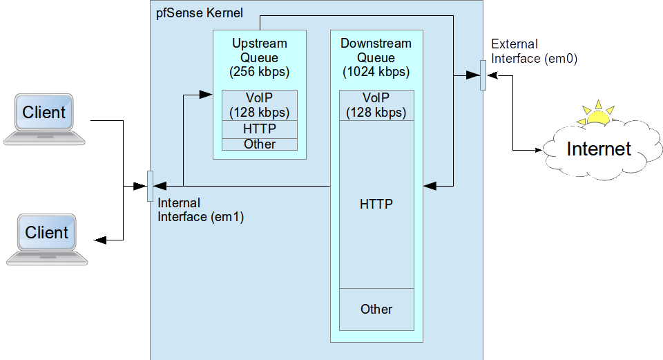
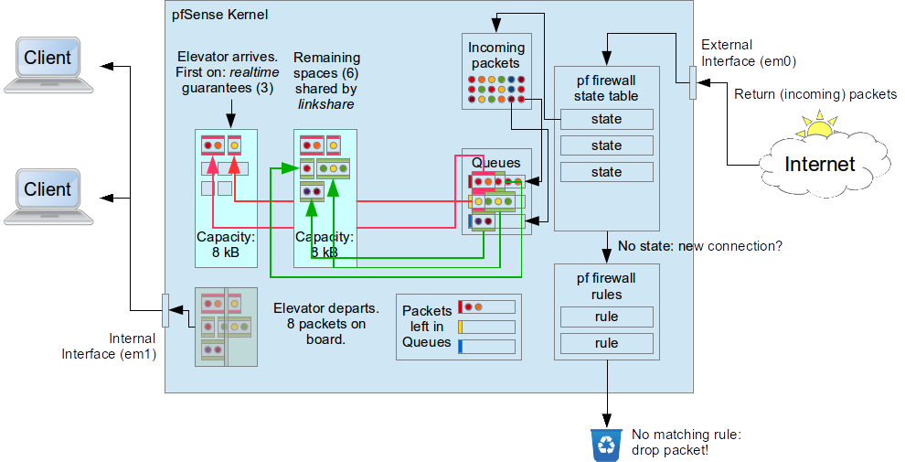
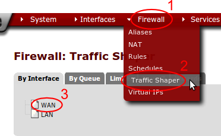
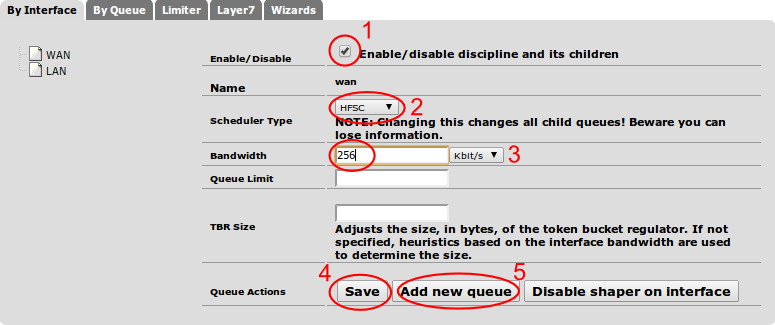
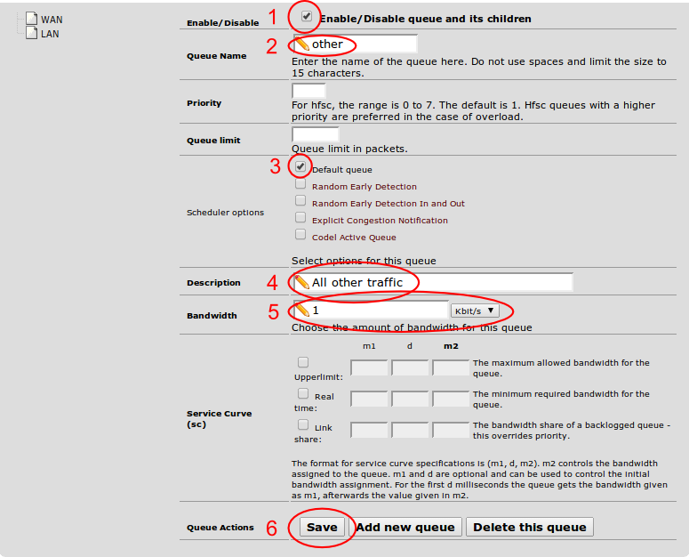
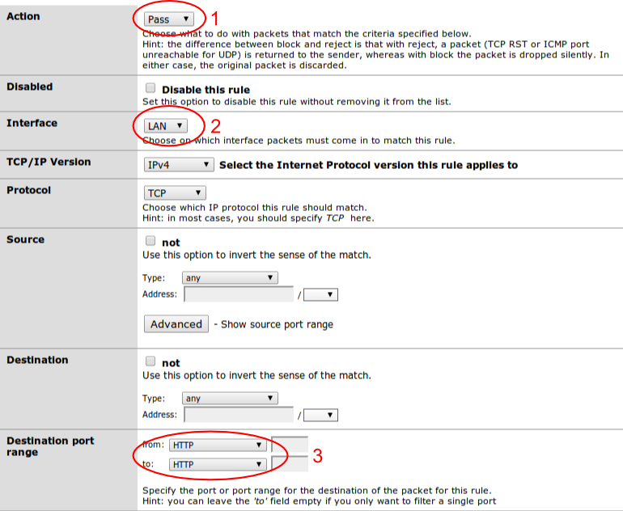
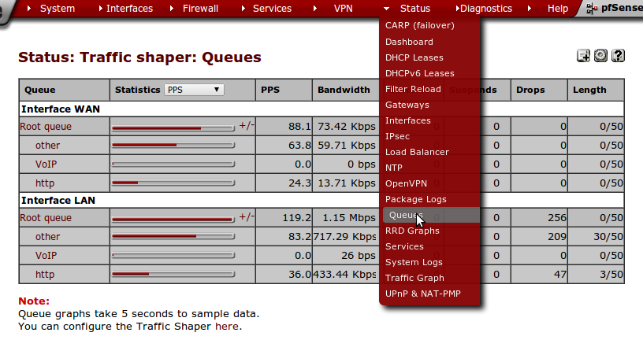

Bandwidth Management with pfSense
---------------------------------

Objectives
~~~~~~~~~~

On completion of this session, we hope you will be able to:

* Configure traffic queues in pfSense
* Classify traffic into queues
* Monitor and debug bandwidth management

.. class:: handout

If you are the facilitator, please tell the group: 

   At the end of session I will ask if we have met the objectives – if not,
   we will discuss again.

License
~~~~~~~

Some materials reused under the Creative Commons
`Attribution-NonCommercial-ShareAlike 2.5 <http://creativecommons.org/licenses/by-nc-sa/2.5/>`_
license:

*	the Web Caching manual, by Richard Stubbs of TENET;
*	the `BMO Book <http://bwmo.net/>`_, by various authors;
*	the `Squid Cache Wiki <http://wiki.squid-cache.org/>`_, by Amos Jeffries
	and other.

Introduction
------------

What is bandwidth management?
~~~~~~~~~~~~~~~~~~~~~~~~~~~~~

Similar to traffic management on roads:

*	Give some vehicles priority over others (e.g. emergency services)
*	Keep one lane clear for priority vehicles
*	Limit the number and length of car journeys
*	Efficiency savings: reduce the need for car journeys (public
	transport, local markets and supermarkets)
*	Make better use of unused capacity: encourage spreading of load
	into off-peak periods
*	Increase the cost of petrol, or charge tolls
*	Arrest people for driving slowly

Also called *traffic shaping* (which is reasonable) and *packet shaping*
(which is not. What shape are your packets?)

Wired Magazine's take
~~~~~~~~~~~~~~~~~~~~~

	Most ISPs actively engage in traffic shaping, bandwidth throttling,
	connection denial or some such tactic to keep the amount of bandwidth
	consumed by high traffic applications on their networks to a minimum.
	While this does often ensure better performance for everyone in the
	neighborhood, it can mean painfully slow transfer speeds for 
	[peer to peer file sharing applications.]
	
	While there are valid arguments for and against shaping, we're not here
	to debate. We just want the fastest BitTorrent transfers possible.
	
http://howto.wired.com/wiki/Optimize_BitTorrent_To_Outwit_Traffic_Shaping_ISPs

What are the limitations?
~~~~~~~~~~~~~~~~~~~~~~~~~

From Ginsberg's theorem (Laws of Thermodynamics):

You can't win.
	Bandwidth management will not make your connection faster. It's just 
	benefiting "more desirable" traffic at the expense of "less desirable."
	Everyone's traffic is desirable to them, so some people will always be
	upset and you need a strong policy argument to defend yourself with.
You can't break even.
	Bandwidth management is not free. You have to reduce your total
	bandwidth in order to own and control the queues. And you have to
	invest a lot of effort into developing, understanding and maintaining
	your policy.
You can't even get out of the game.
	Parkinson's law says that *Work expands so as to fill the time available
	for its completion.* The same applies to traffic and capacity. Unless
	you manage traffic, you will have chaos.

Some other limitations:

Traffic doesn't declare its type or priority.
	In fact, users can try to hide their traffic, for example in a VPN
	or `with encryption <http://howto.wired.com/wiki/Optimize_BitTorrent_To_Outwit_Traffic_Shaping_ISPs>`_
	to evade restrictions on P2P or take advantage of higher service classes.
Bandwidth management is hard to do.
	Bandwidth management applies to TCP/IP packets and network interfaces,
	and debugging tools are very limited (you can't even see what packets are
	in which queue), so you need a deep understanding of what's going on,
	end to end across the Internet. You often need to spend significant time
	monitoring and investigating traffic patterns, or create and test a
	theory, to understand and solve a problem.

.. class:: handout

For example you might have to differentiate between:

*	Skype voice traffic (UDP encapsulated, encrypted, random ports, might be
	direct or via a gateway in Czechoslovakia or a Microsoft IP address)
*	VPN traffic to a
	`BitTorrent anonymiser <https://www.privateinternetaccess.com/>`_
	in the Netherlands? (OpenVPN to UDP port 1194).
*	Your own VPNs (OpenVPN to UDP port 1194).

Or how about distinguishing between large HTTP/SSL downloads and ordinary
web page browsing?

You may have to write rules, exceptions and exceptions to exceptions,
one per class of traffic, to stay on top of assigning traffic to the
correct classes.

Sometimes it's easier to create a whitelist: for example you can filter
traffic from known good sites (academic publishers, etc.) into classes
with high priority access to bandwidth/capacity.

What can we do with pfSense?
~~~~~~~~~~~~~~~~~~~~~~~~~~~~

*	Keep one lane clear (reserve bandwidth)
*	Limit the number and length of car journeys (restrict bandwidth)
*	Efficiency savings (block some kinds of traffic)

Why use pfSense?
~~~~~~~~~~~~~~~~

Linux also has a `traffic management framework <http://www.lartc.org/>`_.
Why do we use pfSense instead of Linux?

*	Advantages:
	*	Nice point and click interface
	*	Graphical display of bandwidth used by each class
	*	Slightly `easier to use <http://blog.aptivate.org/en/blog/2011/08/05/traffic-shaping-with-pf-altq-and-hfsc/>`_
*	Disadvantages:
*		Limited features: no SFQ? no per-connection byte counters?

.. class:: handout

For more information you can read:

*	`OpenBSD PF: Packet Queueing and Prioritization <http://www.openbsd.org/faq/pf/queueing.html>`_
	(pfSense uses the same ``pf`` packet filter as OpenBSD).
*	`Managing Traffic with ALTQ <https://www.usenix.org/legacy/event/usenix99/full_papers/cho/cho.pdf>`_
	(pfSense is based on ALTQ).
*	`Hierarchical Fair Service Curve <http://www.cs.cmu.edu/~hzhang/HFSC/main.html>`_
*	`ALTQ/CBQ Performance <http://www.sonycsl.co.jp/~kjc/cbq/perf.html>`_
	(CPU overhead of scheduling packets)
*	`How Unfair can Weighted Fair Queuing be? <http://eden.dei.uc.pt/~edmundo/Conf%20Internacionais/CI022%202000%20ISCC%20Quadros_1.pdf>`_
	(limitations of work-conserving qdiscs).

How do we start?
~~~~~~~~~~~~~~~~

Limit the maximum bandwidth in and out of firewall.

*	Advantage: allows us to control the queues.
*	Disadvantages:
	*	Requires that we know how much bandwidth is available;
	*	Reduces the available bandwidth;
	*	Limits are per-interface, so interface load balancing doesn't work.

.. class:: handout

Why is this a problem? Because we often don't know exactly how much
bandwidth is available to us. Contention at the ISP may result in us having
less bandwidth than expected at peak times. In order to control the queue,
we have to limit bandwidth to the worst case that we expect, or live with
imperfect control.

The ISP may impose their own bandwidth management on our traffic, which is
outside our control.

Kilobits and kilobytes
~~~~~~~~~~~~~~~~~~~~~~

Questions:

*	What does kbps mean?
*	What does kBps mean?
*	Convert 128 kbps to kBps
*	Convert 128 kBps to kbps
*	Why do we use different units?

.. class:: handout

Answers:

*	kbps is *kilobits per second* (little b = bits, because bits are smaller),
	also called Kbit/s or Kb/s.
*	kBps is *kilobytes per second* (big B = bytes, because Bytes are Bigger),
	also called Kbyte/s or KB/s.
*	128 kbps / 8 = 16 kBps
*	128 kBps * 8 = 1024 kbps
*	We use different units because interfaces transmit one bit at a time,
	so their capacity is measures in bits per second; but computers work
	with whole bytes, so bytes per second is a more logical measure?

Example configuration
~~~~~~~~~~~~~~~~~~~~~

Limit total bandwidth to:

*	1024 kbps download
*	256 kbps upload

Decide how much bandwidth we want to allocate, and to what. For example:

*	Upload:
	*	50% reserved for Voice over IP (VoIP).
	*	30% reserved for HTTP, plus borrowing from remaining traffic (70%).
	*	20% remaining for all other traffic.
*	Download:
	*	12.5% reserved for Voice over IP (VoIP).
	*	70% reserved for HTTP, plus borrowing from remaining traffic (70%).
	*	17.5% remaining for all other traffic.

Question? How much bandwidth (kbps) is reserved for each class?

Why different policies for upload and download?

.. class:: handout

Answers:

*	Upload:
	*	VoIP: 50% x 256 kbps = 128 kbps
	*	HTTP: 30% x 256 kbps = 76.8 kbps
	*	Other: 20% x 256 kbps = 51.2 kbps
*	Download:
	*	12.5% x 1024 kbps = 128 kbps
	*	70% x 1024 kbps = 716.8 kbps
	*	17.5% x 1024 kbps = 179.2 kbps

VoIP tends to be symmetrical. We'd like to allocate 128 kbps in both
directions, which is a much bigger share of our upload bandwidth.
(Welcome to asymmetric connections.)

HTTP tends to be highly asymmetric, and we want it to be fast, so we
allocate the most download bandwidth to it.

Bandwidth Allocation
~~~~~~~~~~~~~~~~~~~~

How HFSC Works
~~~~~~~~~~~~~~

.. class:: handout

Imagine that an elevator arrives every second, with space to carry some
packets to the other side.

Packets are assigned to queues by firewall rules. In pfSense, the queue
has the **opposite** direction to the firewall rule. So a rule that
allows **incoming** packets places the **replies** into the specified
queue. That's normally what you want, because in most client-server protocols,
the replies from the server are much bigger than the request.

So you have a rule that allows HTTP connections **outwards**. The replies
are placed in a queue of your choice, coming back **inwards**.

pfSense uses the `FreeBSD ALTQ framework <http://www.openbsd.org/faq/pf/queueing.html>`_,
with a choice of schedulers:

`Priority Queueing (PRIQ) <http://www.openbsd.org/faq/pf/queueing.html#priq>`_
	Takes packets from the highest-priority queue first, then the second,
	and so on until it reaches the bandwidth limit assigned to the
	interface. It's easy for high-priority traffic to take all the
	bandwidth, leaving low-priority traffic with none. Not recommended.

`Class Based Queueing (CBQ) <http://www.openbsd.org/faq/pf/queueing.html#cbq>`_
	Divides a network connection's bandwidth among multiple queues or classes.
	Queues are arranged in an hierarchy. Child queues are created under the
	root queue, each of which can be assigned some portion of the root
	queue's bandwidth. Queues are served in strict priority order. If
	any bandwidth remains, it can be borrowed by other queues to ensure that
	no bandwidth is wasted.
	
`Hierarchical Fair Service Curve (HFSC) <https://calomel.org/pf_hfsc.html>`_
	Similar to CBQ, but adds real-time guarantees (bounded delay). This
	allows packets to skip the queue if their delay exceeds a fixed amount.

We will use HFSC for this exercise.

Configure pfSense as your router
~~~~~~~~~~~~~~~~~~~~~~~~~~~~~~~~

To do these exercises using pfSense, configure your virtual network as
follows:

.. image:: images/proxy-firewall-network-diagram.png
	:width: 70%
	
In other words:

*	The **external** interface of the pfSense virtual machine
	(*Network Adapter 1*) is Bridged with the external interface of your
	server (probably *eth0*).
*	If your server has two network interfaces, then the **internal**
	interface of the pfSense virtual machine (*Network Adapter 2*) is
	Bridged with the internal interface of your server (probably *eth1*),
	and so is the only network interface (*Network Adapter 1*) of your
	client Virtual Machine. This allows you to connect laptops to *eth1*
	and use them to test your connection, as well as the client Virtual
	Machine.
*	If your server has only one network interface, then the **internal**
	interface of the pfSense virtual machine (*Network Adapter 2*) is
	connected to the *Internal Network pfsense*, and so is the only
	network interface (*Network Adapter 1*) of your client Virtual Machine.
	This only allows you to test your connection from the client Virtual
	Machine.

Configure the Interfaces
~~~~~~~~~~~~~~~~~~~~~~~~

We need to set the total bandwidth and the scheduler on each interface:

*	Open the pfSense webConfigurator and log in.
*	From the menu choose *Firewall/Traffic Shaper*.
*	Click on the *WAN* interface.

*	Check the box *Enable/disable discipline and its children*.
*	Ensure that the scheduler type is set to *HFSC*.
*	Set the *Bandwidth* to ``256`` Kbit/s.
*	Click on the *Save* button.

Now we need to add a queue to the interface. 

*	Click on the *Add new queue* button.

*	Check the box *Enable/Disable queue and its children*.
*	For the *Queue Name* enter ``Other``.
*	Check the box *Default queue*.
*	For the *Description* enter ``All other traffic``.
*	For the *Bandwidth* enter ``20`` and choose *%*.
	*	This is the WAN interface, so we are configuring the upstream bandwidth.
*	Click on the *Save* button.

Repeat the whole process for the LAN interface, but set the *Bandwidth* of
the interface to 1024 Kbit/s instead of 256. Create a queue called *other*
on the LAN interface as well, but with the Bandwidth set to 17.5%.

Notice that pfSense tells you that you need to apply the changes to the
traffic shaper configuration. Click on the *Apply* button.

Questions:

*	Why do we have to create a queue?
*	Why do we have to make it the Default queue?
*	What speed will traffic be limited to on this interface?
*	Which queue will all traffic be placed into, and why?

.. class:: handout

Answers:

There needs to be at least one queue, otherwise pfSense will not apply
any bandwidth limits. If there is no Default queue, then traffic will not
be placed into any queue, and therefore not be limited at all. pfSense will
complain if there is at least one queue on the interface and none of them
is the default queue, but it doesn't complain if there are no queues at all,
it just doesn't work.

No traffic is classified by any firewall rules, yet, so all traffic will
go into the default queue. 

Testing
~~~~~~~

From a computer behind the pfSense router (either your laptop or the
client Virtual Machine), download a large file, for example::

	$ wget -O /dev/null ftp://www.mirrorservice.org/sites/mirror.centos.org/6/isos/x86_64/CentOS-6.4-x86_64-bin-DVD1.iso

What speed do you get? How does it compare with the speed allocated to
Other traffic above?

What happens if you edit the *Other* class on the *LAN* interface,
enable *Upperlimit* and set the *Upperlimit m2* to ``35%``?

.. class:: handout

You should get a download speed of approximately 128 kBps, which equals
1024 kbps. This is because the Other class is allowed to borrow more
bandwidth until it reaches the *Upperlimit*, or the speed limit on the
interface, whichever is lower. In this case there is no *Upperlimit* set,
so it can borrow up to 1024 kbps.

If you set an *Upperlimit* of 35% then it should not be able to use more
than 35% of 1024 kbps, which is 44.8 kBps.

Traffic and Ping times
~~~~~~~~~~~~~~~~~~~~~~

Try pinging the pfSense firewall (which will have the IP address 192.168.1.1
unless you've changed it in class.)

What happens to ping times with and without a download in progress?
Why the difference?

.. class:: handout

Without a download in progress, you should see very short ping times,
around 1 ms::

	PING 192.168.1.1 (192.168.1.1) 56(84) bytes of data.
	64 bytes from 192.168.1.1: icmp_req=1 ttl=64 time=0.480 ms
	64 bytes from 192.168.1.1: icmp_req=2 ttl=64 time=0.385 ms
	64 bytes from 192.168.1.1: icmp_req=3 ttl=64 time=0.537 ms
	64 bytes from 192.168.1.1: icmp_req=4 ttl=64 time=0.350 ms
	64 bytes from 192.168.1.1: icmp_req=5 ttl=64 time=0.454 ms

With a download in progress, you should see much longer ping times, around
150 ms::

	PING 192.168.1.1 (192.168.1.1) 56(84) bytes of data.
	64 bytes from 192.168.1.1: icmp_req=1 ttl=64 time=147 ms
	64 bytes from 192.168.1.1: icmp_req=2 ttl=64 time=136 ms
	64 bytes from 192.168.1.1: icmp_req=3 ttl=64 time=154 ms
	64 bytes from 192.168.1.1: icmp_req=4 ttl=64 time=163 ms
	64 bytes from 192.168.1.1: icmp_req=5 ttl=64 time=132 ms

This is because the ping packets must wait in the queue behind the
download packets, when a download is in progress.

We can reduce this, at the cost of some dropped packets, by reducing the
*Queue limit* on the WAN interface, Other class, to 5 or 10 packets. If
a ping arrives when the output queue on the interface is full, then the
reply packet will be dropped instead of placed in the queue.

Adding more queues
~~~~~~~~~~~~~~~~~~

Edit the WAN interface and add two new classes:

*	From the pfSense menu choose *Firewall/Traffic Shaper*.
*	Click on the *WAN* interface.
*	Click on the *Add new queue* button.
*	Check the box *Enable/Disable queue and its children*.
*	For the *Queue Name* enter ``VoIP``.
*	Make sure that the checkbox *Default queue* is not checked.
*	For the *Description* enter ``Voice over IP``.
*	For the *Bandwidth* enter ``50`` and choose *%*.
	*	This is the WAN interface, so we are configuring the upstream bandwidth.
*	Check the box *Linkshare* and enter ``30%`` for the *m2* value.
*	Click on the *Save* button.

Add another queue called ``HTTP``, with the description ``Web traffic``,
with 30% bandwidth and 30% linkshare.

Edit the LAN interface and add a queue called ``VoIP``, as above, but
with ``12.5%`` bandwidth.

Finally add another queue to the LAN interface, named ``HTTP``, as above, but
with ``70%`` bandwidth.

Filtering traffic into queues
~~~~~~~~~~~~~~~~~~~~~~~~~~~~~

We use firewall rules to assign traffic to a queue. The rule allows the
*outbound* traffic, and at the same time assigns the returning packets into
a queue.

.. image:: images/pfsense-lan-rules-page-2.png

*	From the pfSense menu choose *Firewall/Traffic Shaper*.
*	Click on the *LAN* tab.

If you already have a rule that applies to outbound HTTP traffic, you will
need to change it, instead of creating a new rule:

*	If you create a new rule before that rule, it will override that rule
	because the firewall will match the new rule first.
*	If you create a new rule after that rule, then it will never be hit, and
	your traffic will never be placed into the *http* queue.

.. class:: handout
	
If you have two rules left over from the Web Caching session, one which
allows HTTP from the proxy server and one which blocks HTTP from all other
computers, then you need to decide whether to only allow and restrict the
speed of HTTP from the proxy server, or to allow all computers again.

I recommend that you modify the proxy server rule, to restrict traffic
through the proxy. You'll also need to use the proxy server when conducting
download speed tests below.

Adding filtering rules
~~~~~~~~~~~~~~~~~~~~~~

*	Click on the Add Rule button.

*	For *Action* choose *Pass*. (should be the default).
*	For *Interface* choose *LAN* (should already be set to this).
*	For *Destination port range* choose HTTP.
*	For *Description* enter ``Place web traffic into http queue``.
*	For *Ackqueue/Queue* click on the *Advanced* button, and choose
	*none/http*.
	*  This is backwards for some bizarre reason. You probably always want to specify the queue and not the ackqueue).
*	Click on the *Save* button.

Create another rule to filter UDP traffic into the VoIP queue:

*	Click on the Add Rule button.
*	For *Action* choose *Pass*. (should be the default).
*	For *Interface* choose *LAN* (should already be set to this).
*	For *Protocol* choose UDP.
*	For *Description* enter ``Place UDP into VoIP queue``.
*	For *Ackqueue/Queue* click on the *Advanced* button, and choose
	*none/voip*.
*	Click on the *Save* button.

Finally, create a very similar rule to place *ICMP* traffic (pings) into
the VoIP queue. This allows us to measure VoIP latency and packet loss using
the *ping* command.

You should see a prompt to apply changes to the firewall rules:

Click on the *Apply changes* button.

.. class:: handout

Note that we don't need to classify any traffic as *Other*. Because this is
the default queue, all unclassified traffic will be placed in it
automatically.

Testing
~~~~~~~

What effect is this likely to have on download speeds and ping times?

*	Download speed is still about the same (119 kBps).
*	Ping times massively reduced, to an average of 6 ms.
	(compared to 0.6 ms with no cross traffic, and 50-600 ms with cross
	traffic in the same queue).

How do classes share traffic?

If you run two downloads at the same time, for example run the following
commands in separate terminals or on separate client VMs::

	$ wget -O /dev/null ftp://www.mirrorservice.org/sites/mirror.centos.org/6/isos/x86_64/CentOS-6.4-x86_64-bin-DVD1.iso
	$ wget -O /dev/null http://www.mirrorservice.org/sites/mirror.centos.org/6/isos/x86_64/CentOS-6.4-x86_64-bin-DVD1.iso

They should share bandwidth in the ratio of the *Bandwidth* assigned to
each queue. So we'd expect to see something like this, assuming that the
VoIP bandwidth is not being used, and therefore shared between the other
classes in the ratio of their bandwidth allowance.

Protocol  Realtime/Minimum  Linkshare  Total (%)  Total (kbps)
========= ================= ========== ========== =============
HTTP      70%               10%        80%        819
FTP       17.5%             2.5%       20%        205
========= ================= ========== ========== =============

Unfortunately the allocations are not very accurate, probably because
the queues are sometimes empty, so there's no packet to send
(see `How Unfair can Weighted Fair Queuing be? <http://eden.dei.uc.pt/~edmundo/Conf%20Internacionais/CI022%202000%20ISCC%20Quadros_1.pdf>`_
for details of their results.)

You can see the current bandwidth used in each queue by choosing
*Status/Queues* from the pfSense menu, which will give you a page like
this:

Note that the *Queue Length* will vary as the TCP streams try to adjust
their speed to the amount allocated by the traffic shaping. Every dropped
packet will cause a TCP stream to reduce its speed, and cause the queue
length to drop. The TCP stream will then try to adjust its speed slowly
upwards, searching for the limit again. When the speed is higher than
the allocated bandwidth, the queue will lengthen. When it becomes full again,
another packet will drop and the speed will be reduced again. This process
repeats as long as the TCP stream is running, like this:

.. image: ../Unit_6_Solving_Network_Problems/images/tcp-congestion-response-graphic.png
	:width: 70%
	
Classifying inbound connections
~~~~~~~~~~~~~~~~~~~~~~~~~~~~~~~

Put a large file on the internal web server (Squid proxy VM).
Add a port forwarding rule in pfSense, classifying traffic as HTTP:

*	Choose *Firewall/NAT* from the pfSense menu.
*	On the *Port Forwarding* tab, add a new rule.
*	For *Destination port range* choose *HTTP*.
*	For *Redirect target IP* enter ``192.168.1.100`` or the IP address
	of the internal web server/Squid proxy VM.
*	For *Redirect target port* choose *HTTP*.
*	For *Description* enter ``Forward HTTP to internal web server``.
*	Click on the *Save* button.

Now click on the *Edit* button next to the rule to edit it again, scroll
down to *Filter rule association* and click on *View the filter rule*.

Scroll down to *Ackqueue/Queue*, click on the *Advanced* button and
choose *none/none*. Then click on the *Save* button.

We also want to ping the pfSense external interface from outside, to
measure the queue responsiveness. To do that, add a rule that Passes:

*	Protocol ICMP, ICMP type echo-request
*	Destination: WAN address
*	Description: ``Allow pings to pfSense external``.

You should see a prompt to apply changes to the firewall rules:

Click on the *Apply changes* button.

How can you test this?

.. class:: handout

Try to retrieve the file using the pfSense firewall's external IP address,
which is forwarded to the internal server, and assuming that the pfSense
WAN IP address is 192.168.6.128, use the following command::

	$ wget http://192.168.6.128/bigfile -O /dev/null
	
And ping the external interface. What ping times do you get?

Now edit the NAT rule again, *View the filter rule*, and change the 
*Ackqueue/Queue* to *none/http*. Save the rule and click *Apply changes.*

You'll need to start the ``wget`` command again. What happens to the ``ping``
time, with and without the ``wget`` running?

FIN
---

Any questions?

.. class:: handout

Have we met the objectives?

*	Configure traffic queues in pfSense
*	Classify traffic into queues
*	Monitor and debug bandwidth management

Please let us know if we haven't.
