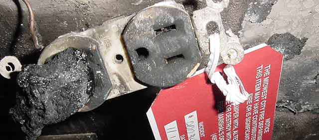
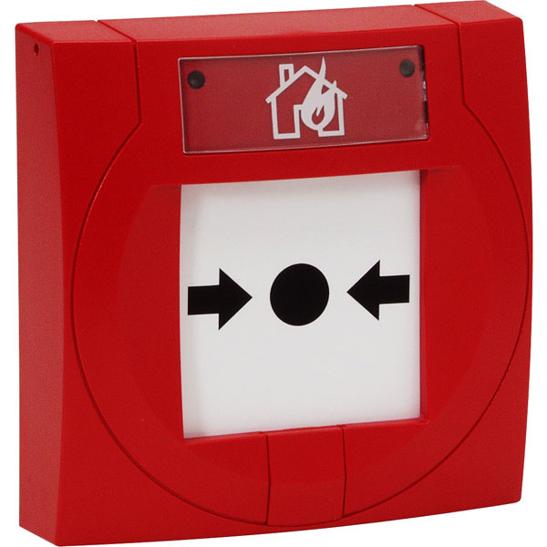
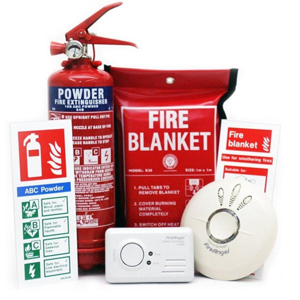

What is Fault Management?
-------------------------

ISO says:

	Detect, isolate, notify, and correct faults encountered in the network.

Cisco says:

	The goal of fault management is to detect, log, notify users of,
	and (to the extent possible) automatically fix network problems to keep the
	network running effectively. Because faults can cause downtime or
	unacceptable network degradation, fault management is perhaps the **most
	widely implemented** of the ISO network management elements.

.. class:: handout

Why is it the *most widely implemented*? Because the first task of a
network administrator is to *keep the network running*.

Some network admins never get beyond that part. Too busy fighting fires.
Our aim is to get beyond there, but how?

**Reduce downtime by reducing, eliminating and preventing faults.**

Why Fault Management?
---------------------

* The first task of a network administrator is to *keep the network running*.
* Effectiveness measured by *uptime* and *downtime* of services.
* Faults cause immediate, severe problems for users (and hence for us).

.. class:: handout

Feel free to challenge these assumptions!

If they are correct, then how do we maximise our effectiveness at this task,
so that we reduce our stress, and have more time for better network
management by implementing the other processes identified by the ISO?

Better Fault Management
-----------------------

How can we manage faults best, and prevent them from becoming disasters?

*	Reduce incidences of faults
*	Reduce effects of faults
	* faster diagnosis
	* redundant systems
*	Detect and correct faults quickly (before users do)
*	Keep users informed

.. class:: handout

It's important to avoid firefighting as much as possible, because:

* some system is not working, so users can't work;
* users are complaining and losing confidence;
* repair will have to be done quickly, under extreme time pressure;
* we tend to make mistakes when under pressure: more haste, less speed;
* we forget to clean up (documenting, fixing temporary patches);

In this unit we'll cover some principles of fault detection. Later on,
in Unit 6, we'll cover network troubleshooting in more detail.

Fire fighting analogy
---------------------

How do these components:

*	Reduce incidences of faults?
*	Speed up detection and diagnosis?
*	Aid rapid action?
*	Keep users informed?

.. class:: handout

These principles are well known and apply to all kinds of systems, not
just networks!

*	Eliminate dangerous items from the network, or contain them where
	they cannot cause further damage.

*	Use early warning systems to detect faults quickly, before too much
	damage has occurred.

*	Give users a way to report problems, and notify them when a problem is
	occuring.

What problems can we deflect?
-----------------------------

*	Users report faults all the time.

*	What faults do you NOT want to fix?

*	Can you set boundaries on your responsibilities?

.. class:: handout

We need boundaries to be relaxed. Otherwise, the amount of work you
might be asked to do is infinite:

* "Fix my printer!"
* "Fix my light switch!"
* "Fix my telephone!"

Please spend a few minutes making a list of common problems that you're
expected to solve.

To be a relaxed sysadmin, we must spend less time solving urgent problems
like these. We can do that by:

* Limiting our domain (job description), e.g. "no electrics". This makes it
  someone else's problem.
* Understanding user problems and solving them before they occur

Limiting our domain is a policy issue, needs management support:

* Decide what you want to support
* Negotiate with management to get it in writing (policy)
* Post it on the door and walls of the IT centre and online helpdesk

For example, you might be able to:

* Make it someone else's job to fill up the printer?
* Get a support contract for your Internet connection?
* Shut down the internal phone system and use mobiles instead?

We can also help users to help each other, by setting up a forum for
self-help within the organisation, and helping people to use online
resources to solve problems themselves (for example ServerFault.com).
Could you allow users to sign for and collect more paper or toner
themselves?

.. class:: exercise

Group work: try brainstorming out a list of 10-15 problems. Include some
which you consider to be your job, and some which you'd like to refuse.

Look at your list of faults, and cross off the ones that can realistically
be made someone else's problem, or where users could help themselves.

How do we diagnose faults?
--------------------------

Users report faults all the time.

We need an objective standard to verify and understand them, quickly.

What could cause these faults?

* "The internet is slow"
* "The printer is broken"

How would you identify or eliminate possible causes?

.. class:: handout

Users aren't usually lying, but they often don't understand the problem:

* **The internet is slow** could mean "Internet Explorer is running slowly"
  or "I have too many programs open" or "I stepped on my network cable and
  now it's broken".

* **The printer is broken** could mean "the cable is broken" or "my nephew
  uninstalled the printer driver from my computer" or "I changed my default
  printer and don't know how to change it back."

We have a lot of practice at diagnosing problems, often by hand.
There can be better ways to do it.

How can we learn and improve?
-----------------------------

Whenever you solve a problem, take five minutes at the end to think about:

* how could you have solved it more quickly?
* how could you prevent it from happening again?

.. class:: exercise

Apply this to some of the problems on your list, in a group.

Note the value of group work. Building a support community for yourself
can have massive benefits. Help others, and they will help you when you
need it.

Discuss together:

* How would you check the printer status?
* How would you tell if the user's computer is running slowly?
* How would you tell if the user's computer is connected to the network?
* How would you tell if the Internet connection is OK?

Now discuss the problems on your own lists in your groups. If you are
working alone, try to find solutions online, for example using communities
like the Server Fault website. Don't be afraid to ask new questions on these
sites if you can't find a solution!
