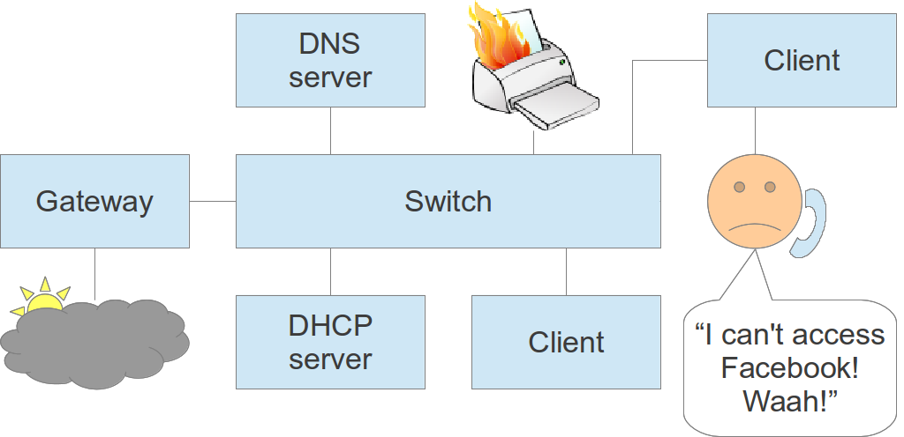

Do it remotely
--------------

If possible, diagnose and repair faults remotely:

* Saves you travelling time.
* Allows you to check many potential causes quickly.
* First step towards automation.

But sometimes, face-to-face contact is more important! (When?)

.. class:: handout

Faster diagnosis of faults means a higher level of user satisfaction and
quality of service. The whole university network runs better.

.. class:: exercise

Discuss in your groups:

* How would you check the printer status **remotely**?
* How would you tell if the user's computer is running slowly **remotely**?
* How would you tell if the user's computer is connected to the network
  **remotely**?
* How would you tell if the Internet connection is OK **remotely**?

Remote diagnosis tools
----------------------

What problems could these tools help you with?

* Printer's built-in web server
* Switch's built-in web server
* Windows remote destop (mstsc)
* Windows performance counters
* ``ping``
* ``traceroute``
* A network diagram

.. class:: handout

There are many useful command-line and graphical tools that can help you
to diagnose problems remotely:

*	Most printers have a web server that tells you their status, if you
	connect them to the network.
*	You can use Windows Remote Desktop or VNC to log into a computer and
	Task Manager to check its performance.
*	You can enable Windows' Performance Counters and access these remotely
	over the network. (Memory, swap, disk and CPU usage would be particularly
	useful).
*	You can use the ``ping`` command to check the network connection of a
	computer or the Internet.
*	You can use the ``traceroute`` command to identify routing hops between
	you and a target computer, locally or on the Internet (layer three).
*	Managed switches have web interfaces that you can use to check port
	link status (you did write down what's connected to each port? :-)
	and connected MAC addresses (in case you didn't).
*	You can use `Netdot <https://osl.uoregon.edu/redmine/projects/netdot/wiki>`_
	to automatically draw network diagrams at layer two, to help you diagnose
	layer two faults (between switches).

.. class:: exercise

Look at your list of faults, and identify which tools you could use to
diagnose them. Use the Internet or brainstorm in a group to generate ideas.

Practical session
-----------------

* A fault has been reported
* Don't just dive in and fix it!
* Brainstorm ideas for what to check
* The facilitator will answer your questions

.. class:: exercise

You may have been given a real, faulty piece of equipment, or if all our
equipment is working perfectly, the facilitator may simulate a fault for you.
If it's a real fault, you may be able to use network tools to investigate it
yourself.

Your facilitator might ask you to refer to this network diagram:

If you are the facilitator, you may want to set up a test network like this
for practice purposes.
