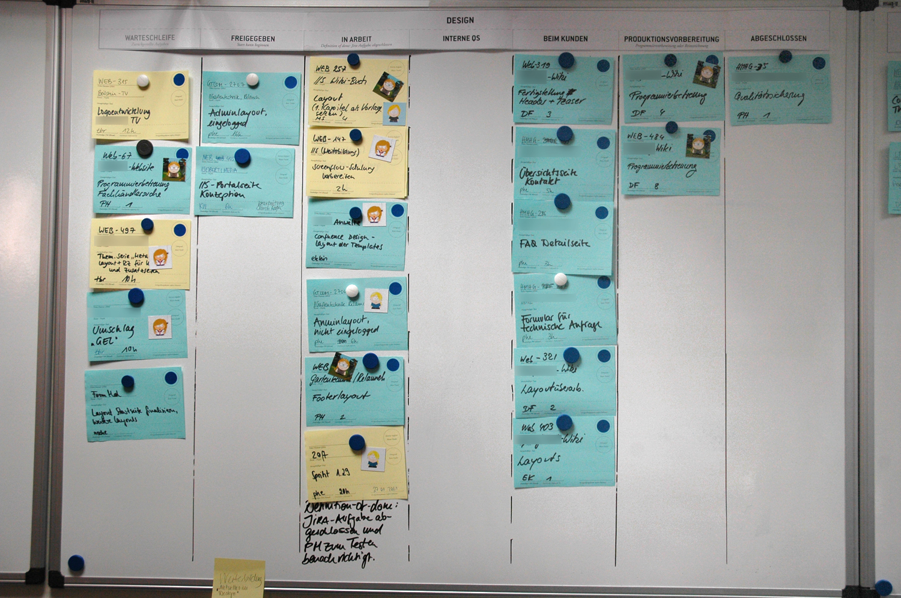

Early detection
---------------

If we can detect the fault early, we have more time to fix it, which means
less stress and more flexibility:

	A stitch in time saves nine

How could you detect early warning signs of the problems on your list?

.. class:: handout

We can sometimes predict a problems before it occurs, and take evasive
action:

Printer running out of toner.
	We can monitor the printer automatically with Nagios, which will
	send us email when the toner is running low.

Or we can detect them before users notice and complain about them:

Internet connection slowing down.
	If causes by one individual's excessive traffic, we can identify them,
	talk to them or take other measures to reduce their impact before other
	users complain.

Fewer noticed faults means a higher level of user satisfaction and
quality of service. The whole university network runs better.

The more problems we can detect, the less firefighting we'll have to do,
the calmer and less stressed we will be, and the better we can do our jobs
to our own satisfaction.

Thinking Required
-----------------

Warning: **hard work required!**

	Rarely do we find men who willingly engage in hard, solid thinking.
	There is an almost universal quest for easy answers and half-baked
	solutions. Nothing pains some people more than having to think.
	-- Martin Luther King, Jr.

We all need time to relax and concentrate!

Adding to the List
------------------

Think about detection:

* After each problem is solved
* Make a list, or ticketing system
* Set aside time (meeting or thinking)
* Imagine future problems
* When creating or modifying a system
* Generalise from other systems

.. class:: handout

This process requires reflection. At least reflect on each problem after
you solve it. It could be difficult to

you can make a list of problems.
Analyse your day and see what you spend time on. Even better, track problems
through a ticketing system, including how long it took to resolve them.

The more problems we can detect, the less firefighting we'll have to do.

After each problem is solved
~~~~~~~~~~~~~~~~~~~~~~~~~~~~

Will you have enough time to do it properly? When you have multiple
emergencies, it's difficult to relax and concentrate on defensive measures
for the future.

Make a list
~~~~~~~~~~~

A list of some kind is your **most important tool** in tackling the problem.
Even a paper list can help, but it's hard to rearrange and add information,
and it becomes messy. Kanban cards or an electronic ticketing system can
help:

* Kanban cards are easier to visualise and move around.
* Tickets are easier to sort, search, integrate with other systems
  and access remotely.

Set aside time
~~~~~~~~~~~~~~

Ideally set aside half a day every month, or an hour a week, to start with,
and increase if necessary. Arrange cover or close the IT office. Switch your
phone off, so you can concentrate.

If you work alone, then spend the time thinking, preferably out of the
office but with access to your list. If you work in a group, then have a
meeting.

Run through your list, or at least the urgent and high priority items.
Make a plan for dealing with it, allocate time and block that time out
in your diary.

Running through the list shouldn't take more than an hour or two, so you
can use the rest of the time time work on the highest priority tasks.

Time Boxing
~~~~~~~~~~~

This is a time management technique that helps us to achieve everything that
we plan to. Time boxing is **strict scheduling**, where we do not allow
ourselves to overrun the allocated time. If we are about to overrun, we
can use the last few minutes to leave the task in a state where we can
pick it up later, for example documenting what we did and what we were
about to do, estimate how much more time is required, and schedule that
time in our diaries to continue working on the task then.

Imagine future problems
~~~~~~~~~~~~~~~~~~~~~~~

Reacting to problems **after** they happen is a start, but we can do much
better.

Make a "monitoring" list of all the systems that you can think of, which
are your responsibility to manage. For each one, think about:

* how it might fail,
* how you could detect that,
* how you could automate monitoring of it,
* how you could prevent it from failing.

Put actions onto your task list to deal with these failures in the best way
possible.

When creating or modifying a system
~~~~~~~~~~~~~~~~~~~~~~~~~~~~~~~~~~~

Whenever you create a new system, for example a web server, a ticketing
system or install a printer, add it to your monitoring list and apply the
same process as above.

Generalise
~~~~~~~~~~

Try to apply the same solutions to multiple problems where possible. For
example, monitoring all web servers, printers or IP phones using the same
tool. Automated monitoring systems like ``Nagios`` allow you to create
``host groups`` that apply the same checks to any number of devices,
by placing them into the group. For example, you could make a group of
``web servers`` and add everything that has a web interface to the group,
whether it's a printer, a department website or Google.

