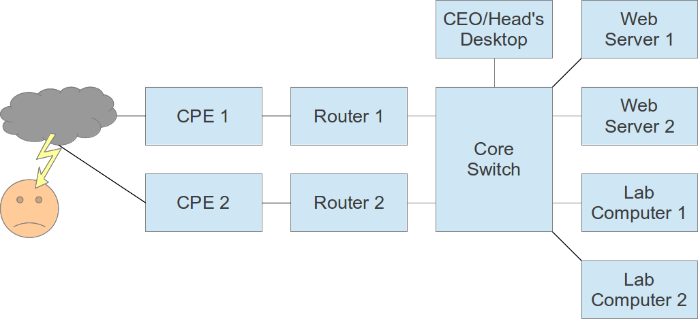
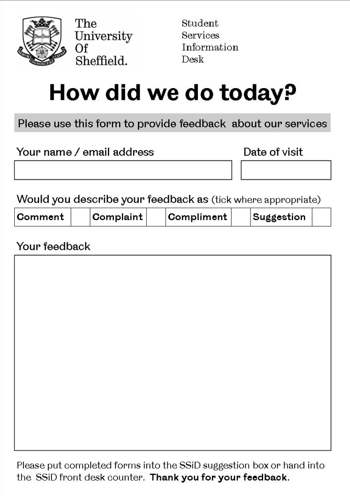

How do we mitigate faults?
--------------------------

Make faults less likely:

	* redundant systems
	* automatic failover
	* automatic updates (some risk)
	* more reliable technology
	* failure prediction and prevention
	* test your disaster plans!

Make faults less severe or urgent:

	* how can users continue to work without this system?

.. class:: handout

Reducing severity of faults means a higher level of user satisfaction and
quality of service. The whole university network runs better.

Solutions to consider
~~~~~~~~~~~~~~~~~~~~~

How can users continue to work (maybe more slowly or less conveniently)
without some system:

* a computer lab they could use instead of their desktop?
* a spare computer they could borrow?
* a wireless network they could use instead of the LAN?
* some way to send mail even if the main mail server is down?
* a backup (slower) internet connection/provider?

Look at your list of faults, and identify how you could mitigate each one,
making it less likely or less severe. Use the Internet or brainstorm in a
group to generate ideas.

Automatic Failover
~~~~~~~~~~~~~~~~~~

In some cases you can make the fallback system automatic. This is known
as **automatic failover**. This usually requires the most work to set up
and keep running. For example:

* Most servers can use redundant power supplies and disks and
  error-correcting (ECC) RAM to reduce the risk that hardware failure will
  cause an outage. Sometimes a failed part can be replaced without bringing
  the system down for maintenance (hot swap).
* Web, database, file and mailbox servers can be configured in a cluster with
  automatic replication, so that the backup server has a full copy of all
  the latest data, changes and configuration, and will be activated
  automatically if the primary fails.
* Virtualised servers can often be moved to a new host without downtime
  (VMWare ESXi, OpenVZ and Proxmox support this).
* Many routers allow **hot failover** of the IP address from a primary
  to a backup router, but this requires you to keep the configurations
  manually synchronised between the two. Alternatively you could have
  different configurations using different Internet connections, and
  still have the router's internal IP address switched from the master
  to the secondary automatically, using ``VRRP`` or ``CARP``. Open TCP/IP
  connections will be disrupted, so this should only be done when really
  necessary.
* Some routers can automatically switch from a primary to a secondary
* Many IP phone systems allow calls to automatically be forwarded to another
  number, such as the user's mobile phone, if their desk phone is faulty
  (switched off or unplugged).
* Some print servers allow multiple printers to service the same queue,
  and the next available printer will handle each job.
* Email (SMTP) can be handled using backup mail exchangers (MXes) which hold
  and deliver outbound mail, or queue incoming mail to the server holding
  the user's mailbox.

Some redundant systems protect against hardware failure, but not against
user accidents such as files being deleted or corrupted. Therefore it's
important to have other protection mechanisms too, such as backups.

Backups
~~~~~~~

Backups fall into three broad categories:

Full system images
	High space requirements, easy to restore whole systems, difficult to
	restore individual files, may require downtime for complete consistency,
	slow to backup so usually run daily or weekly.
Continous file protection
	Lower space requirements, not designed to restore whole systems,
	easy to restore individual files, not good for databases or email,
	usually not consistent, back up changed files almost immediately
	throughout the day and keep many versions.
Incremental backups
	Fall somewhere between these two extremes depending on the technology.

It's usually a good idea to have **both** full system images (for quick
restore in case of a complete failure) **and** continuous file protection
(for quickly restoring individual corrupted files, and the latest changes
after a complete system failure).

Hot Spares
~~~~~~~~~~

Sometimes it's too difficult to keep the backup server exactly synchronised
with the main one (especially mailbox and file servers). In these cases
you might have a physical spare server that's kept running (a **hot spare**)
and synchronized every hour, or every day, with the master server. If you
need to fail over to the hot spare, users will still have some service, but
they may lose their most recent work.

Cold Spares
~~~~~~~~~~~

You can also keep spare hardware available but switched off (a **cold spare**)
ready to be put into service by having a system image backup restored to it.
Virtualisation alternatively allows you to temporarily overload some
host servers in case of a failure, which will make systems slower but they
will continue to function.

Redundancy Example
------------------

Study this network diagram and identify the single points of failure,
and possible solutions including fallbacks (lower capability):

How do we keep users informed?
------------------------------

* Why does it matter to users?
* When do you notify them?
* What do you tell them?
* How do you tell them?

.. class:: handout

By notifying users when a fault has occurred, we allow them to plan their
time, to avoid frustration and wasting time. This results in a higher level
of user satisfaction and quality of service.

The network does not run better, but people are happier if their time is
not being wasted.

We can notify users in advance, as soon as we know that a fault or
reduced service will occur. The more advance warning they have, the better
they can plan, and the less effect the downtime will have on them.
But it will never be zero, so it's still better to avoid or mitigate
downtime if possible.

If we did not notify them in advance, we can notify them as soon as
possible when a fault has occurred.

In both cases, we can tell them when it will be fixed by. If we can't
do that, we should make it clear why we don't know, what we are doing to
find out, and when we expect to have more information by.

We can keep users informed of current and future status, for example by
having a network status and planned outages web page. We can encourage
users to check this page before contacting IT support or submitting fault
reports. We can make the page easy to find and to update.

How do we get better?
---------------------

* Desire to improve
* Reflect on what we did
* Inquire into other possibilities
* Share knowledge with peers
* Ask users for their opinion

.. class:: handout

From `Reflective Practice on Wikipedia
<http://en.wikipedia.org/wiki/Reflective_practice>`_:

	Reflective practice is "the capacity to reflect on action so as to
	engage in a process of continuous learning", which, according to the
	originator of the term, is "one of the defining characteristics of
	professional practice".

	It involves "paying critical attention to the practical values and
	theories which inform everyday actions, by examining practice
	reflectively and reflexively. This leads to developmental insight".

	Reflective practice can be an important tool in ... individuals
	learning from their own professional experiences, rather than from
	formal teaching or knowledge transfer. It may be the most important
	source of personal professional development and improvement. As
	such the notion has achieved wide take-up, particularly in professional
	development for practitioners in the areas of education and healthcare.

	The question of how best to learn from experience has wider relevance
	however, to any organizational learning environment. In particular,
	people in leadership positions have a tremendous development opportunity
	if they engage in reflective practice.

One great value of a support ticket system is in examining closed tickets.
Regularly take a sample and ask yourself:

* How do you know it was resolved?
* Has it happened again since?
* How many times has this happened?
* How much frustration or difficulty does it cause?
* Could you reduce the risk or severity of it happening?
* How long did it take to resolve? Could it be faster?
* Could you add monitoring to detect if it happens again?

Also, look at the users of the system. How many people will come back
next time they have a problem? If not, why not? Does the system reward
or discourage them?

What fraction of support tickets are duplicates? How much extra work do
they create? Can the system do anything to reduce them, such as searching
for similar tickets and offering them to the user? Can you provide self-help
information, such as instructions on resolving common problems?

How long does it take to resolve a support request/ticket? Is the time
reasonable? Could it be reduced?

If some requests are denied, because they fall outside the scope of the
IT department's responsibility or contradict policy:

* How many requests are successfully resolved and how many denied?
* Do successful and denied requests fall into categories?
* Could you help users to know in advance whether their request is likely to be
  accepted or denied?

It's a good idea to schedule time regularly to work on these issues.
Preferably, leave a minimal support staff at the office, and work from a
quiet place with phones off, where you can think clearly without distraction.

Personally I like to reflect, immediately after a problem is resolved, to
find two sensible ways to prevent that problem from happening again, and
implement both of them.

If you don't have time to implement them immediately:

* Make a list of things to do.
* Schedule a reasonable amount of time each month to work on them.

Recognise and reward staff who provide excellent service to users.

Tell people about what you do. Write an organisational blog about the
changes you've made to improve service. If users believe that you can
change, they are likely to try to change you. *This is an excellent thing*.

Your users know what the biggest problems are. Who are your most important
users? Do you talk to them?

