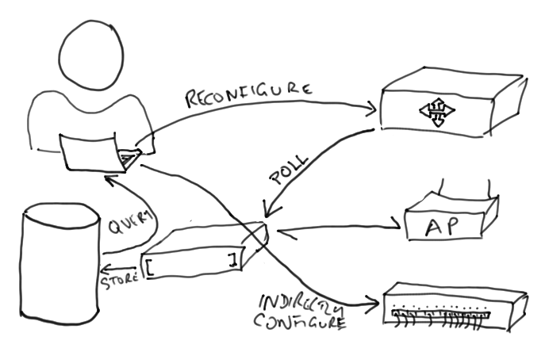

What is Configuration Management?
---------------------------------

Recording changes to configuration of network devices, for example:

* configuration file management,
* inventory management,
* software management.
* package management.

Why use Configuration Management?
---------------------------------

Configuration Management helps us to answer the following questions:

* What changed?
* When did it change?
* Why did it change?
* Can we put it back?
* Can we solve the problem a better way?

.. class:: handout

Thus, it helps us to solve two important problems:

*	We often need to understand what caused a problem in terms of changes
	to a system, in order to reverse them or find a better solution.

*	We often want to repeat the changes, for example setting up a new router
	or server in minimal time, or reconfiguring all routers at the same time.

Configuration management is a form of *version control*, applied to
system configurations: configuration files, installed packages and updates,
registry changes, connection maps and diagrams.

Benefits of Configuration Management
------------------------------------

* Always have an up-to-date network map for troubleshooting.
* Replace hardware more quickly.
* Faster testing of new configurations, with quick reversion.
* Easier and more reliable creation of test labs.
* Inventory for insurance, updates, patching and impact assessment.
* Diagnosing and repairing a fault caused by a configuration change.
* Better communication in a network management team.
* Better license compliance.

Configuration management is hard
--------------------------------

Includes the entire state of every device:

* The partition layout, entire filesystem and registry of servers;
* The physical connections between machines and network devices;
* The configuration files of devices.

That's a lot of data! Where will you put it?

Configuration management of servers
-----------------------------------

* Another reason to have backups!
* Can you quickly identify file and registry changes?
* How quickly can you restore a server?

Configuration management of the network
---------------------------------------

Tools like ``Netdisco`` and ``Netdot`` can automatically draw network maps
for you.

``RANCID`` can collect

A lot of data! Do you have space?

How would you do it?

.. class:: handout

Some problems with this scope:

* Do you have space to back up your entire servers?
* Do you have the software and time to run those backups?
* How quickly can you identify a one-file change in a 400GB full-system backup?
* How do you monitor or backup physical connections between devices?
* How do you backup devices that don't have an automated interface?
* How do you cope with encrypted, binary or unreadable configuration files?
* How do you deal with dynamic configuration, such as IP addresses?
* What happens if you forget to document a change, or don't have time?

Some possible solutions:

* Can automatically monitor some switches and routers configurations with
  `RANCID <http://www.shrubbery.net/rancid/>`_: Cisco routers, Juniper
  routers, Catalyst switches, Foundry switches, Alteon switches, and HP
  Procurve switches among others.
* `Netdot <https://osl.uoregon.edu/redmine/projects/netdot/wiki>`_ can
  automatically generate network maps for you.
* Can configure Linux and FreeBSD servers using Puppet or Chef to make
  initial configuration easier.
* Can standardise and automate installation of servers.
* Can use full-system backups that support listing the changes between
  two abitrary increments, and restoring just those files (e.g.
  ``rdiff-backup`` or ``duplicity`` plus shell scripting).
* Can reduce the number of people allowed to make configuration changes.
* Can set policy to require documentation for changes.
* Can monitor servers and routers for unexpected or unauthorised changes,
  for example using ``tripwire`` or backup systems.

