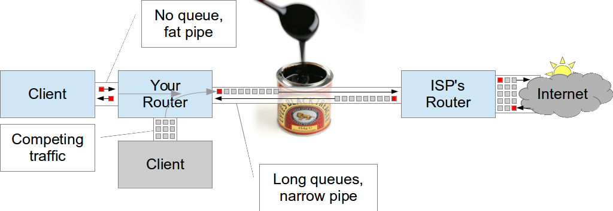

.. include:: <s5defs.txt>

.. include:: ../includes/Series.rst

Unit 5: The Bandwidth Challenge
===============================

.. include:: ../includes/Authors.rst

Objectives
----------

On completion of this session, we hope you will know about:

	* Importance of Internet in network management
	* Why is Internet bandwidth particularly scarce?
	* Why is that a problem?
	* How does it relate to IT/network management?
	* How can we fix it? What can we change?

Why do we care about Internet access?
-------------------------------------

What is your Internet connection used for?

.. class:: handout

Why else do you have a campus network?

What is it used for? Do you know? (Monitoring can tell you)

How much do you spend on your campus network? On your Internet connection?

Please share your views with the group about whether having an Internet
connection is important to your university.

`JANET <https://www.ja.net/products-services/janet-connect/janet-connections>`_
is the UK NREN (National Research and Education Network), providing Internet
and inter-university connectivity, support and services. (Basically the
equivalent of your University internet/NREN connection).

163 UK universities are connected, at an average cost of £32,000 (USD 50,000)
per year. <https://community.ja.net/sites/default/files/network-charges-calculation-12-13-issue-1.xls>
Their total budget is £6.4 million (USD 10 million).

JANET installed bandwidth grew approximately `400% per year 
<http://www.cs.kent.ac.uk/people/staff/pfl/presentations/janet-meas/sld022.htm>`_
between 1995 and 2000 (old figures, I know):

About `60% of JANET's traffic came from outside JANET
<http://www.cs.kent.ac.uk/people/staff/pfl/presentations/janet-meas/sld015.htm>`_
(i.e. the Internet).

Why is it so expensive?
-----------------------

African universities pay 50x more for the same bandwidth as Europeans:

	"While a university in Germany might pay about US $4000 per month
	for 1 gigabit per second of bandwidth, a school in Kenya can expect to
	pay $200 000 for the same service." `IEEE Spectrum, Feb 2013
	<http://spectrum.ieee.org/telecom/internet/how-bad-is-africas-internet>`_.

.. class:: handout

	The Association of African Universities (AAU) conducted a `connectivity
	survey <http://events.aau.org/userfiles/file/AAU_Connectivity%20Survey_2010_PHamilton.pdf>`_
	during 2008 from universities in West and Central Africa. The study
	identified a bandwidth deficit for universities in the region and that...
	these universities would fall further and further behind their own
	estimated bandwidth requirements and the level of bandwidth which is
	*required for performance-leading work and teaching conditions*.
	
	` The Socio-Economic Impact of Broadband in sub-Saharan Africa:
	The Satellite Advantage
	<http://www.cto.int/wp-content/themes/solid/_layout/dc/ptojects/Socio-Economic_Impact_of_Broadband_The_Satellite_Advantage.pdf>`_

How did this happen?

*	Lack of infrastructure, especially copper and fibre networks
*	Lack of competitive service providers
*	High costs of installing infrastructure
*	Long delay in investment and deregulation

Key findings from ATICS survey 2006
-----------------------------------

* African university = European home
* Pays 50x more than European home
* Limited bandwidth per computer
* Always congested (over 60% of the time)
* 59% of institutions do not monitor or manage bandwidth

.. class:: handout

Note: this survey was in 2006, the results may be outdated.

Demand for bandwidth is increasing everywhere
---------------------------------------------
	

Effects of higher demand than supply
------------------------------------

Abuse of shared resource hurts others
-------------------------------------

.. class:: handout

In economics, the `tragedy of the commons
<http://en.wikipedia.org/wiki/Tragedy_of_the_commons>`_ is:

*	the depletion of a shared resource by individuals,
*	acting independently and rationally according to each one's self-interest,
*	despite their understanding that depleting the common resource is
	contrary to the group's long-term best interests.
	
This happens on a network when:

*	there is no incentive for users to limit their use of bandwidth

	* for example, financial cost, punishment, self-harm

*	users are allowed to use bandwidth to the point that it affects others
*	network or bandwidth management is not used (the default)

Shared resources always need management. More users -> more management.
This is not unique to African universities!

Effects of bandwidth challenges
-------------------------------

* What Internet resources are hard to use?
* How much money and time is wasted?
* What effect does this have on the university?

.. class:: handout

Difficulties in using Internet based information resources and communication tools:

    - Digital library resources are under utilised
    - Resource license costs can be less effective
    - Free or low cost resources are difficult to take advantage of
    - The digital library revolution is difficult to participate in
    - Continued digital divide

Under utilisation of ICT capacities and investments:

    - Bandwidth charges of $5,000 per month that result in an unusable link –
      is that money well spent?
    - Infrastructure costs e.g. PC computer labs that users spend most
      of their time sitting around waiting for pages to display – is
      that money well spent?

Impacts on a university’s core activities, especially those that require
up to date and a wide range of information resources e.g. teaching and
research.
  
Possible solutions?
-------------------

-  Doing nothing
-  More bandwidth and at lower cost
-  Better management of existing resource
-  Combination of the above

.. class:: handout

What would happen if we doubled our bandwidth?

* It will always need managing to ensure maximum efficiency
    
Group Discussion
----------------

What challenges does your institution face with network management?

What impact are they having on:

* User satisfaction?
* User perception of IT staff performance?
* How the outside world sees your institution?

How are these issues being addressed within your institution?

.. class:: handout

* Technically?
* With policies?
* With both?
* If not, why not?

	* Time? Resources? Money? Wrong incentives?

You may want to nominate a group representative to capture the key points
of the discussion on a flipchart sheet.

Plenary Discussion
------------------

Please present the results of your group discussions.

* One representative, 5 minutes per group.
* Please focus on your top three-five challenges/solutions.

During the discussion of other groups’ results, please consider:

* Are there similarities with your institution?
* Are there differences?
* Are there lessons that you can learn?

Can you help?
-------------

* What problems are you experiencing?
* Have you found a good tool or skills?
* Give us the benefit of your experience: especially with a successful
  problem resolution!
* Share your knowledge with others, don't hide or sell it.
* Build a community in your country.
