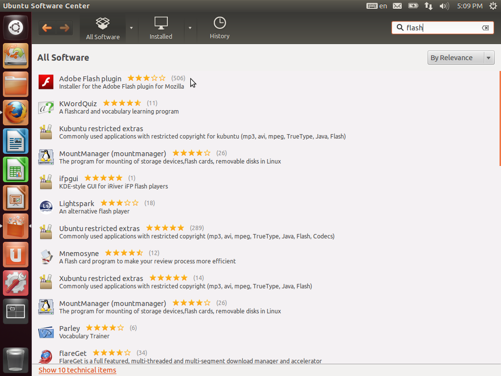
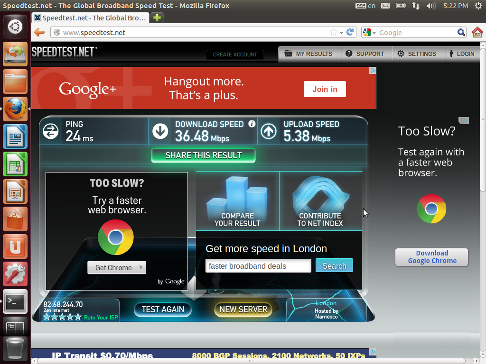
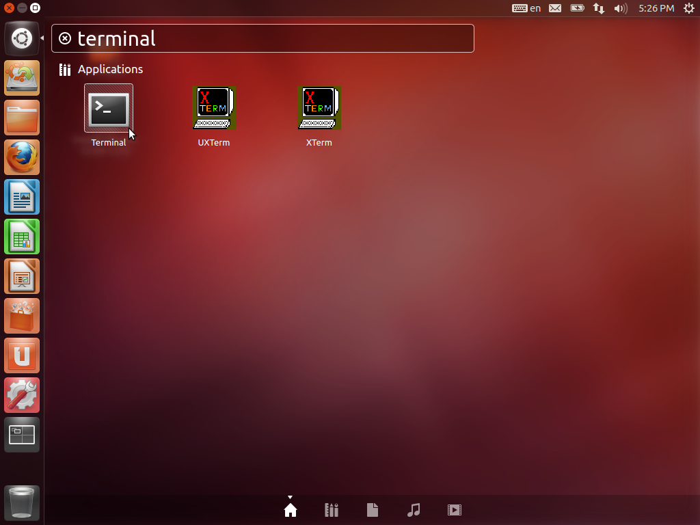
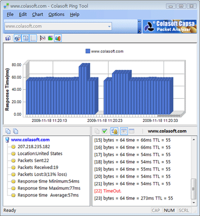

.. include:: <s5defs.txt>

.. include:: ../includes/Series.rst

Unit 6: Solving Network Problems (Exercises)
============================================

.. include:: ../includes/Authors.rst

Objectives
----------

On completion of this session, we hope you will know about:

* Measuring current available bandwidth

Getting Started
---------------

These exercises require you to boot up an Ubuntu 12.04 Live CD. You can
also do this from an installed Ubuntu 12.04 Desktop system.

Conventions
-----------

We sometimes use the symbol ``$`` as a shortcut for *type this at a
Unix command-line prompt*, because the prompt character often ends with a
``$`` sign by convention. So where you see this sign, it's followed by
a command to run. Don't type the ``$`` character!

Measuring available bandwidth using a speed test
------------------------------------------------

You need to install the Flash Plugin to use the Speedtest websites.
Open the Ubuntu Software Centre, search for *Flash*, and install the
*Adobe Flash Plugin*.

Now open the *Firefox* browser, go to *www.speedtest.net* and start a
speed test. Your results should look something like this:

What results did you get? What will happen if several people run speed
tests at the same time?

Measuring available bandwidth using a large download
----------------------------------------------------

We need the URL of a large file to download, from a server near you:

* In a web browser, go to `www.centos.org -> Downloads -> Mirrors -> CentOS Public Mirror List
  <http://www.centos.org/modules/tinycontent/index.php?id=30>`_.
* Choose your region (e.g. *South American ... African and Other*).
* Find an organisation near you and click on the HTTP column (**not** the
  organisation name!).
* If you get an error page, go *back* and choose a different one.
* Follow the links to *6 -> ISOs -> i386*.
* Don't click on any of the files, but right-click on
  *CentOS-6.4-i386-minimal.iso* 

Your browser will start to download the file. What speed do you get? In
bits per second?

Measuring available bandwidth from the command line
---------------------------------------------------

We can do the same thing from the command line, which makes it easier
to automate the test. Open a terminal:

Install Apache with the following command::

	sudo apt-get install apache2

And then run ``ab``. Right-click and choose Paste to paste the URL of
the ISO image into the terminal. It should look something like this:

	chris@lap-x201:/tmp$ ab http://mirror.ufs.ac.za/centos/6/isos/i386/CentOS-6.4-i386-minimal.iso
	This is ApacheBench, Version 2.3 <$Revision: 655654 $>

	Benchmarking mirror.ufs.ac.za (be patient)...

What speed do you get (``ab`` calls it
*Transfer rate*) in bits per second?

..	Commented out for now:
	Install Nagios plugins to measure bandwidth
	-------------------------------------------

	Install Nagios to monitor bandwidth automatically
	-------------------------------------------------

	Install the Nagios software with the following command::

		sudo apt-get install nagios3

	During installation you will have to configure Postfix for e-mail,
	if it's not already configured:

	* Use the *Internet site* configuration to allow Nagios to send you email
	alerts. 
	* You may need to pretend to be a mail server for a domain where
	*nagios@domain* is a valid email address, and which doesn't block you
	from sending with SPF or DKIM. Otherwise your own mail server might
	reject the email. ``aptivate.org`` might work.
	* For *root and postmaster mail recipient*, give your own email address.
	* Don't accept mail for any destinations; delete all the domain names
	from the list, leaving it blank.
	* On a real system, you'd better force synchronous updates on the mail queue,
	so do it here too.
	* Leave *Local networks* at the default settings.
	* Leave the *Mailbox size limit* set to ``0``.
	* Leave the *Local address extension character* set to ``+``.
	* Leave *Internet protocols to use* set to ``all``.

Your route to the Internet
--------------------------

Trace the route out of your network to the Internet with this command::

	traceroute 4.2.2.2

The results you get will totally depend on where you are. The result I
get from here looks like this::

	$ traceroute 4.2.2.2
	traceroute to 4.2.2.2 (4.2.2.2), 30 hops max, 60 byte packets
	1  192.168.0.1 (192.168.0.1)  2.896 ms  3.058 ms  3.392 ms
	2  * * *
	3  cmbg-core-1a-ae2-3971.network.virginmedia.net (62.253.128.165)  9.509 ms  13.367 ms  13.513 ms

I know that Virgin Media is my ISP, so the first hop that reverse-resolves
to Virgin Media is the first router at my ISP.

If the hops don't reverse-resolve, you might get something like this::

	traceroute to 4.2.2.2 (4.2.2.2), 30 hops max, 60 byte packets
	1  192.168.0.1  2.012 ms  2.104 ms  2.388 ms
	2  * * *
	3  62.253.128.165  12.034 ms  13.062 ms  15.637 ms

In that case, you may need to use the ``whois`` command to see who owns
each IP address. For example, check the ownership of ``192.168.0.1``::

	whois 192.168.0.1

What do you see? Who owns it? Now check the next address, for example::

	$ whois 62.253.128.165
	inetnum:        62.253.128.0 - 62.253.129.255
	netname:        INFRASTRUCTURE
	descr:          NTL Infrastructure - Cambridge

In this case, I know that NTL was bought by Virgin Media, so this belongs
to my ISP.

Investigating congestion and latency
------------------------------------

Now try monitoring the latency to this address with the ``ping`` command:

	$ ping 62.253.128.165
	PING 62.253.128.165 (62.253.128.165) 56(84) bytes of data.
	64 bytes from 62.253.128.165: icmp_req=1 ttl=62 time=11.0 ms
	64 bytes from 62.253.128.165: icmp_req=2 ttl=62 time=8.86 ms
	64 bytes from 62.253.128.165: icmp_req=3 ttl=62 time=16.0 ms
	64 bytes from 62.253.128.165: icmp_req=4 ttl=62 time=15.3 ms
	64 bytes from 62.253.128.165: icmp_req=5 ttl=62 time=15.0 ms

What is the round trip time? How much does it vary? If the ping time is low
(less than 20 ms is good guess) then the connection is not congested. If it
looks congested, talk to the network manager or try a different connection,
so you can see what an uncongested connection looks like.

Why do we ping this computer and not any other? It's at the far end of
what we expect to be the slow link (the bottleneck) between you and the
Internet. If we pinged a closer computer, we would see little or no effect
from any congestion, because our ping don't have to pass through it.
If we ping a computer further away, we'd see the congestion, but there would
be more noise from other users of our ISP and more random variation in
the results, which would hide the congestion that we're looking for.

You will still see congestion due to other users on your connection.
This test works best if there are no other users, for example if you
pick a quiet time on the network, or you have a dedicated connection.

Kill the command by pressing Ctrl+C. What do you see? What is the average
ping time?

Now let's try to create some congestion. Start the ping again, and then
start downloading a large file (using the ``ab`` command or your browser)
as we did earlier. Watch what happens to the ping time:

	64 bytes from 62.253.128.165: icmp_req=78 ttl=62 time=12.8 ms
	64 bytes from 62.253.128.165: icmp_req=79 ttl=62 time=14.6 ms
	64 bytes from 62.253.128.165: icmp_req=80 ttl=62 time=166 ms
	64 bytes from 62.253.128.165: icmp_req=81 ttl=62 time=120 ms
	64 bytes from 62.253.128.165: icmp_req=82 ttl=62 time=113 ms

Do you see an effect? How big is it? If the ping time goes over 100 ms,
I would say that's a sign of mild congestion, and over 300 ms would be
serious congestion, that would affect Skype usage for example.

If you have a Windows computer, you can use the free `Colasoft Ping Tool
<http://www.colasoft.com/ping_tool/index.php?c=b>`_ to draw graphs of ping
times:

Try this with a friend, colleague or the person next to you. One person
runs the ``ping`` command, or Colasoft Ping Tool. The other person starts
and stops downloading a large file. The first person has to guess when the
second person starts and stops downloading. When you get good at guessing
to within 5 seconds, swap roles with the other person.

If you can easily tell when a download starts or stops, then the network
**could be better managed**! Users should have **no impact** on each other.

If the ping times vary randomly and you can't spot when a download starts
or stops because there's too much noise, you'll need to create your own
congestion simulator (bottleneck) using the instructions in the next section.

If you don't see a big impact, then the network might be very well managed,
or the server that you're downloading from can't keep up with your connection.
(Maybe your connection is very fast, or the server is heavily loaded). Try
downloading from a few different servers at the same time to see if you can
fill up the connection.

If you can see the congestion using ``ping``, try benchmarking web page
loading speed with and without a download running::

	$ ab -n 100 http://www.google.co.uk/
	This is ApacheBench, Version 2.3 <$Revision: 655654 $>
	...
	Time per request:       72.448 [ms] (mean)

What's the difference between ``ping`` and loading a web page? One is
artificial and one is a *real world* test. Which is which?

Simulating Congestion
---------------------

If you're using a really well-managed network, you will not see the effects
of congestion from running a large download. However, you may want to
simulate the effects so that you can see what it looks like first hand,
and the effect that it has on web page loading speed.

To do this, we will download `FreeBSD 9.1 <http://www.freebsd.org/>`_. We
use FreeBSD because it has a better network simulator (dummynet) than Linux,
which can introduce delays as well as bandwidth limits.
