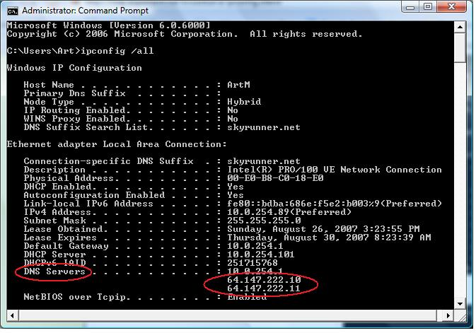
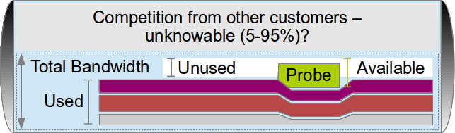
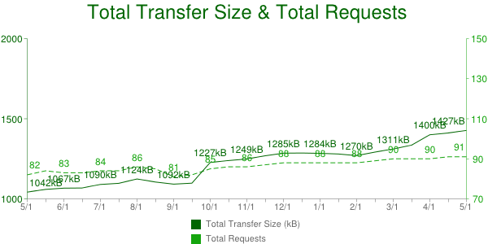
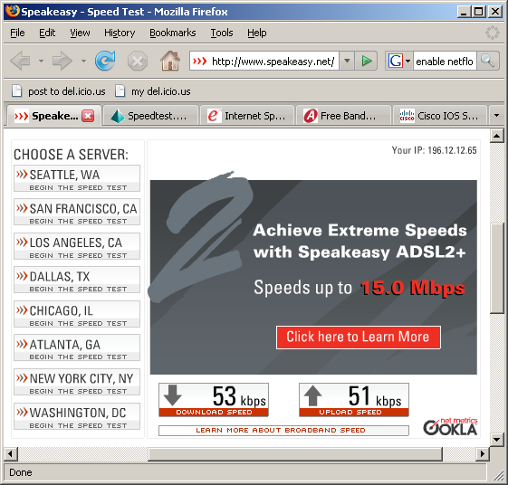
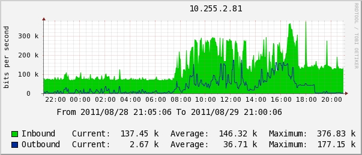
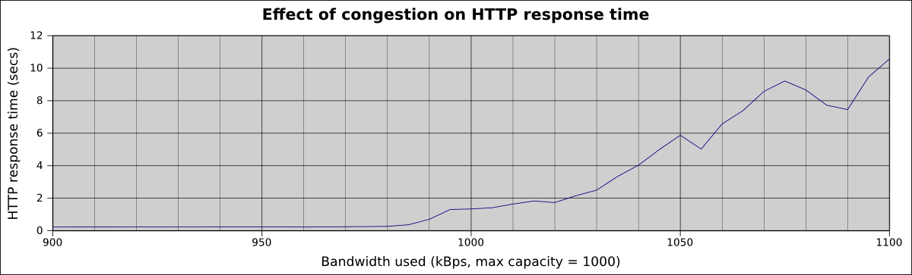

.. include:: <s5defs.txt>

.. include:: ../includes/Series.rst

Unit 6: Solving Network Problems
================================

.. include:: ../includes/Authors.rst

Portions of this chapter reused from the e-book `How to Accelerate your
Internet <http://bwmo.net/>`_ under the Creative Commons
Attribution-ShareAlike 2.5 license.

Objectives
----------

On completion of this session, we hope you will know about:

* Importance of troubleshooting in network management
* Troubleshooting vs. monitoring
* Good troubleshooting technique
* Troubleshooting a rogue DHCP server
* Troubleshooting a slow Internet connection

What is troubleshooting?
------------------------

* Identify the problem
* By manual, logical deduction
* To help us fix it

Troubleshooting is not monitoring
---------------------------------

Once the network is working well, we set up monitoring to:

* warn us if it stops working well
* help us troubleshoot more quickly

Next unit is about monitoring.

.. class:: handout

For example, if you can't access your mail server, what would you do?

* You troubleshoot, and discover that the mail server has crashed.
* You set up monitoring (Nagios_) to alert you if the mail server crashes
  again, before your users complain, so that you can fix it faster.
* You set up monitoring to find out why the mail server is crashing, for
  example you enable crash dumps and CPU and memory use logging.

Troubleshooting is not management
---------------------------------

Emergency quick fixes (fire-fighting) will not keep the network running well!

But it's a necessary part:

* unexpected things will happen
* need to understand to fix them quickly
* and to prevent them happening again
* or detect and resolve more quickly next time
 
Proper troubleshooting technique
--------------------------------

* Prepare for problems (see Unit 3/Disaster Response)
* Responding to a problem
* Identify possible causes
* Eliminate causes

Responding to a problem
-----------------------

You might want to print this out and display on your wall!

* Don't panic
* Find a quick test
* Understand the problem
* Is it plugged in?
* What was the last thing changed?
* What is "known good"?
* Make a backup
* Change one variable at a time
* Do no harm

.. class:: handout

In more detail:

Don't panic
	inform your users of the problem, and set about solving it in a
	methodical and guided manner.

Find a quick test
	Doing something complicated to identify the problem involves more
	steps, more complexity and makes the whole troubleshooting process
	more difficult/slower. Find something like the "refresh" button
	in your browser, or a command-line command such as `ping`, that tells
	you whether the thing is working or not, right now.
	
Understand the problem
	If you are troubleshooting a system, that means that it was working at
	one time, and probably very recently. Before jumping in and making
	changes, survey the scene and assess exactly what is broken. Historical
	logs and statistics may help to identify it. Be sure to collect
	information first, so you can make an informed decision before making
	changes.
	
	Draw a diagram, or picture in your head, all the steps that are required
	to make the thing work. One of those steps must be failing. Make a list
	of them. Quickly check each one:

Is it plugged in?
	This step is often overlooked until many other avenues are explored.
	Plugs can be accidentally (or intentionally) unplugged very easily. Is
	the lead connected to a good power source? Is the other end connected to
	your device? Is the power light on? It may sound silly, but you will
	feel even sillier if you spend a lot of time checking out an antenna
	feed line only to realise that the AP was unplugged the entire time.
	Trust me, it happens more often than most of us would care to admit.

Is it apparently OK?
	Many things have a quick visual status check:
	
	* switches and computers have link lights for network ports;
	* a desktop computer should display a graphical screen and respond 
	  to mouse movements;
	* a server should display a console and respond to keyboard or mouse
	  movements;
	* you should be able to open a website such as Google, or an internal
	  server;
	* you should be able to ping a server, desktop or managed switch.
	
What was the last thing changed?
	If you are the only person with access to the system, what is the last
	change you made? If others have access to it, what is the last change
	they made and when? When was the last time the system worked? Often,
	system changes have unintended consequences that may not be immediately
	noticed. Roll back that change and see what effect it has on the problem.

Eliminate possibilities
	Try to attack the problem in different ways. If a server appears to be
	down, try checking from a different point on the network, or "closer"
	to the server, or "closer" to where the problem is noticeable from.
	
	.. image:: images/troubleshooting-network-diagram.png
	   :width: 50%
	
	Imagine a network problem with server A is visible from a user's
	computer (point B) and from your computer (point C), which diverge at
	the core switch (point D). So the paths are A-D-B and A-D-C. It's unlikely
	that both D-B and D-C have failed at the same time, so you can
	"eliminate" them for now, and test the shared path A-D instead.
	
	On the other hand, if the problem is visible from the user's computer (B)
	but not from your computer (C), then you know that you've tested A-D
	and D-C by testing from your computer. So the problem must be between
	D and B.
	
What is "known good"?
	This idea applies to hardware, as well as software. A known good is any
	component that you can replace in a complex system to verify that its
	counterpart is in good, working condition.
	
	For example, you may carry a tested Ethernet cable in a tool kit. If you
	suspect problems with a cable in the field, you can easily swap out the
	suspect cable with the known good and see if things improve. This is
	much faster and less error-prone than re-crimping a cable, and
	immediately tells you if the change fixes the problem.
	
	Likewise, you may also pack a backup battery, antenna cable, or a CDROM
	with a known good configuration for the system. When fixing complicated
	problems, saving your work at a given point lets you return to it as a
	known good, even if the problem is not yet completely solved.

	Look at your list of steps again. Which ones can you quickly replace to
	see what effect that has on the problem?
	
Change one variable at a time
	When under pressure to get a failed system	back online, it is tempting
	to jump ahead and change many likely variables at once. If you do, and
	your changes seem to fix the problem, then you will not understand
	exactly what led to the problem in the first place.
	
	Worse, your changes may fix the original problem, but lead to more
	unintended consequences that break other parts of the system.
	
	By changing your variables one at a time, you can precisely understand
	what went wrong in the first place, and be able to see the direct
	effects of the changes you make.
	
	Ideally, when you find the change that seems to fix the problem, revert
	it and check that the problem reappears. Then you can have much more
	confidence that you've found the real cause.
	
	Configuration Management (covered in Unit 3) can help you to remember
	exactly what you changed, and revert any changes that you didn't intend
	to make or that didn't appear to solve the problem.

Do no harm
	If you don't fully understand how a system works, don't be afraid to
	call in an expert. If you are not sure if a particular change will damage
	another part of the system, then either find someone with more experience
	or devise a way to test your change without doing damage. Putting a
	penny in place of a fuse may solve the immediate problem, but it may also
	burn down the building.

Example: Internet access not working
------------------------------------

How would you troubleshoot it?

.. class:: handout

Some hints:

* Check other websites and applications
* Ping some servers
* Check your DNS
* Traceroute to find the break

It happens all the time. Suddenly, the network isn't working at all. What do
you do? Here are some basic checks that will quickly point to the cause of
the problem.

First make sure the problem is not just with the one web server you want to
contact. Can you open other websites such as www.google.com? If you can
open popular web sites but not the one you requested, the problem is likely
with the site itself, or with the network between you and the other end.

If your web browser cannot load pages from the Internet, next try to browse
to a server on the local network (if any). If local sites are shown quickly,
then that may indicate a problem with the Internet connection or the proxy
server. If not, then you most likely have a problem with the local network.

If you suspect a problem with the proxy server, try accessing information
with a different program, such as an email client. If you can send and
receive email, but web browsing still doesn't work, then this may further
indicate problems with the proxy server.

Your web browser and mail client can only provide so much information. If
nothing seems to be working at all, it's time to switch to a more useful
diagnostic tool such as ping.

Try pinging a server on the Internet with a well-known IP address
such as ``4.2.2.2`` or ``8.8.8.8``::

	$ ping 4.2.2.2
	PING 4.2.2.2 (4.2.2.2) 56(84) bytes of data.
	64 bytes from 4.2.2.2: icmp_seq=1 ttl=247 time=85.6 ms
	64 bytes from 4.2.2.2: icmp_seq=2 ttl=247 time=86.3 ms
	64 bytes from 4.2.2.2: icmp_seq=3 ttl=247 time=84.9 ms
	64 bytes from 4.2.2.2: icmp_seq=4 ttl=247 time=84.8 ms
	--- 4.2.2.2 ping statistics ---
	4 packets transmitted, 4 received, 0% packet loss, time 3012ms
	rtt min/avg/max/mdev = 84.876/85.436/86.330/0.665 ms

If you can ping an IP address then your basic connectivity is working,
so the problem may be another setting. If not, the problem may be at your
ISP, or your connectivity to them. ``traceroute`` may help you to identify
where the problem is.

Try pinging a well-known web server that responds to pings, such as
``www.google.com``::

	$ ping www.google.com
	PING www.l.google.com (66.102.9.99) 56(84) bytes of data.
	64 bytes from 66.102.9.99: icmp_seq=1 ttl=243 time=30.8 ms
	64 bytes from 66.102.9.99: icmp_seq=2 ttl=243 time=31.6 ms
	64 bytes from 66.102.9.99: icmp_seq=3 ttl=243 time=30.9 ms
	--- www.l.google.com ping statistics ---
	3 packets transmitted, 3 received, 0% packet loss, time 2016ms
	rtt min/avg/max/mdev = 30.865/31.176/31.693/0.395 ms

If this works as well, it indicates that your network connection is working
just fine, and the problem is very likely with your proxy (or your web
browser's proxy settings).

If you can ping an IP address but not a domain name, then the network is fine
but your computer is unable to convert the domain name (www.google.com)
into an IP address (66.102.9.99). Check to make sure that your DNS server is
running and is reachable.

If you can't ping an Internet IP address, then it's a good idea to make sure that
your local network connection is still working. Does your computer have a valid
IP address? Use ifconfig on UNIX or ipconfig on Windows to make sure
your IP settings are correct.

If you don't have an IP address then you are definitely not connected to the
Internet. Check the cables from your computer (or the wireless settings if using
wireless). Also check that your DHCP server is up and running, if you use
DHCP. If you have an IP address but it is incorrect, then there are only two
possibilities. Either your machine is using the wrong settings, or there is a
rogue DHCP server on the local network. Either change your local settings or
track down the bad DHCP server.

If you do have a valid IP address, try pinging the gateway's IP address::

	$ ping 192.168.0.1
	PING 192.168.0.1 (192.168.0.1) 56(84) bytes of data.
	64 bytes from 192.168.0.1: icmp_seq=1 ttl=64 time=0.489 ms
	64 bytes from 192.168.0.1: icmp_seq=2 ttl=64 time=0.496 ms
	64 bytes from 192.168.0.1: icmp_seq=3 ttl=64 time=0.406 ms
	64 bytes from 192.168.0.1: icmp_seq=4 ttl=64 time=0.449 ms
	--- 192.168.0.1 ping statistics ---
	4 packets transmitted, 4 received, 0% packet loss, time 2999ms
	rtt min/avg/max/mdev = 0.406/0.460/0.496/0.035 ms

If you can't ping your gateway then the problem is definitely in your
local network -- maybe the switch or router needs to be restarted. Check all
the cables (both network cables and power cables).

If you can ping your gateway, then you should next check the Internet
connection. Maybe there is a problem upstream. One good test is to log
into your gateway router and try to ping the gateway at your ISP:

* If you cannot ping your ISP's gateway, then the problem is with your
  Internet connection.
* If you can ping your ISP's gateway but no other Internet hosts, then the
  problem may exist beyond your ISP. It's probably a good idea to phone your
  ISP and check if they have a problem, or can help you with troubleshooting.

Is everything still not working? Then it's time to roll up your sleeves and
get to work. You should reread the `Responding to a problem`_ section and
settle down for some slow and methodical work, checking each part of your
network bit by bit.

Example: Rogue DHCP server
--------------------------

One of the most common network problems: an unexpected DHCP server
causes havoc by assigning users the wrong IP addresses.

.. class:: handout

A misconfigured DHCP server, either by accident or intentionally malicious,
can wreak havoc on a local area network. When a host sends a DHCP request on
the local network, it accepts whichever response it receives the fastest.
If the rogue DHCP server hands an incorrect address faster than your own DHCP
server, it can potentially blackhole some of your clients.

Most of the time, a rogue DHCP server is either a misconfigured server or
wireless router. Rogue DHCP servers are difficult to track down, but here
are some symptoms to look for:

* Clients with improper IP addresses, netmasks, or gateways, even though
  your DHCP server is configured correctly.
* Some clients can communicate on the network, others cannot. Different IP
  addresses are being assigned to hosts on the same network.
* Rebooting a client makes it randomly start working or stop working.
* While sniffing network traffic, you see a DHCP response from a server
  IP or MAC address that you do not recognise.

Once you have determined the rogue DHCP server's MAC address from a
packet trace, you can then make use of various layer 2 tracing techniques to
determine the location of the rogue DHCP server, and isolate it.

It's almost impossible to completely prevent rogue DHCP servers from
appearing on your network. But there are some steps you can take:

* Educate your users on the dangers of misconfiguring or enabling DHCP
  services on your local LAN.
* Windows and UNIX systems engineers and users setting up access points on
  your local LAN should be careful not to place such a service on the local
  LAN.
* Some switching hardware platforms have layer 2 filtering capabilities to
  block DHCP responses from network interfaces that should never be
  connected to a DHCP server. On Cisco switching platforms, you may want
  to use the "dhcp snooping" feature set to specify trusted interfaces which
  are allowed to transmit DHCP responses (the ones connected to your DHCP
  servers). Apply these to server access ports and all uplink ports on your
  switch fabric.
* Use a network monitor such as Nagios_ to detect unexpected DHCP server
  replies on your network and raise the alarm.
  
Example: Slow Internet connection
---------------------------------

What do you need to check?

* DNS speed
* proxy server
* ping times/latency
* available bandwidth
* free bandwidth

How slow is it?
---------------

What are response times (latency) for loading external sites?

Measure the speed loading a specific web page, for example
http://www.google.com, using the ``ab`` utility::

	ab -n 100 http://www.google.com/
	This is ApacheBench, Version 2.3 <$Revision: 655654 $>
	...
	Requests per second:    18.16 [#/sec] (mean)
	Time per request:       55.081 [ms] (mean)
	Transfer rate:          17.52 [Kbytes/sec] received

.. class:: handout

You need something to compare it to, for example:

* How fast is it when the connection is not busy?
* How fast is it using another ISP?
* Is it less than one second?

Standard are arbitrary, but `Jakob Nielsen argues 
<http://www.nngroup.com/articles/response-times-3-important-limits/>`_ that:

* > 0.1 second delay loses the *instant* feeling.
* > 1.0 second interrupts the user's flow of thought.
* > 10 seconds and you lose the user's attention.

So if web pages load in 0.1 seconds that's really good; less than 1 second
is OK, and over 1 second is bad (annoying).

You can automate this test using Nagios_ and receive an alert by email
whenever the speed of web page loading becomes too slow.

What influences page loading speed?
-----------------------------------

*Both* the available bandwidth *and* the latency are lower bounds:

* a link with 1 Mbps free cannot load a 1 MB page in less than 8 seconds,
  however low the latency;
* a link with 3 second latency cannot load the page in less than 9 seconds,
  however much bandwidth is free.

Don't forget DNS server and proxy latency.
  
.. class:: handout

Keep **link latency** and **free bandwidth** under control to ensure
that web pages load fast.

**DNS responses** are cached, but it's worth monitoring how fast they are
too, otherwise you can have random long delays which are hard to diagnose.

If you have a **proxy server**, it should be monitored too.

Check the DNS server
--------------------

.. class:: handout

You can check your DNS speed quickly using the UNIX ``host`` command-line
tool, for example::

	$ host www.google.com
	www.google.com has address 173.194.41.180

The reply may take a second if you haven't looked up the site before.
After that it should be immediate, because the DNS server should cache it.

If not, which DNS server are you using? The command ``ipconfig /all`` should
tell you:

If you're not using a local, cacheing DNS server, you should be.

Don't use your ISP's DNS servers directly on your computers if you can help
it. It's much better to use local cacheing DNS servers. These should be
the only computers configured to use your ISP's servers as an upstream.

However you can use the UNIX ``host`` command to test a specific server,
to see if it gives a faster response. For example, if one of your ISP's DNS
servers is 192.168.14.40, you can test it like this::

	$ host www.google.com 192.168.14.40
	;; connection timed out; no servers could be reached

That means that your ISP's server has crashed. This will cause random slow
page loading while your local caches wait for a reply from this server.

You can check all your local DNS servers (the ones listed by ``ipconfig``)
to make sure that they all reply, and quickly. If any fails to reply, that
will cause random, slow page loading. It may mean that:

* your DNS server has crashed; or
* it has the wrong network configuration; or
* it is using the wrong upstream servers; or
* one of the upstream servers has crashed; or
* your Internet connection is down or overloaded.

You can configure a network monitor such as Nagios_ to warn you if a
DNS server stops responding, or takes too long.

Check the proxy server
----------------------

.. class:: handout

You can use the UNIX command-line tool ``ab`` (ApacheBench) to check a
proxy server::

	$ ab -P fen-vz-proxy.aptivate.org:3128 http://www.google.com/
	This is ApacheBench, Version 2.3 <$Revision: 655654 $>
	...
	Complete requests:      1
	...
	Requests per second:    20.04 [#/sec] (mean)
	Time per request:       49.895 [ms] (mean)
	Time per request:       49.895 [ms] (mean, across all concurrent requests)
	Transfer rate:          19.34 [Kbytes/sec] received

Or you can configure your browser to use the proxy server, and see
if you can access web pages.

If that doesn't work (``ab`` complete requests is not 1, or the page
doesn't load) then try disabling the proxy in your browser, or running
``ab`` without the ``-P`` option. This will only work if your firewall
allows you to bypass the proxy server, which is not recommended for network
security. You may want to temporarily allow direct access, and disable it
after testing.

You can configure a network monitor such as Nagios_ to warn you if the
proxy server stops working.

Check ping times (latency)
--------------------------

Ping a server on the Internet, for example ``www.bbc.co.uk`` or
``www.google.com``::

	$ ping www.bbc.co.uk -n
	PING www.bbc.net.uk (212.58.244.69) 56(84) bytes of data.
	64 bytes from 212.58.244.69: icmp_req=1 ttl=56 time=19.6 ms
	64 bytes from 212.58.244.69: icmp_req=2 ttl=56 time=19.4 ms
	64 bytes from 212.58.244.69: icmp_req=3 ttl=56 time=19.2 ms
	64 bytes from 212.58.244.69: icmp_req=4 ttl=56 time=19.4 ms

.. class:: handout

As a rule of thumb, time to load a small web page is about 3 round trips.
So based on Jakob Nielsen's results above, the ping time should be:

* < 30 ms is really fast (feels instantaneous)
* < 300 ms is noticeable but usable (for web access, not for Skype)
* < 3000 ms to avoid losing the user's attention (unbearably slow)

From a broadband connection in the UK, ping time to ``www.bbc.co.uk``
would normally be under 30 ms.

You can configure Nagios_ to warn you if the ping time goes over this
threshold.

Interactive applications
------------------------

* Latency sensitive
* Usually less bandwidth intensive
* May require bandwidth reservation

.. class:: handout

Interactive applications include:

* Real-time Voice over IP (VoIP) and videoconferencing applications,
  such as Skype;
* Online whiteboards and collaborative tools (Kanban, Trello, games);
* Remote desktop applications (Citrix, Microsoft Terminal Services).

These applications are able to operate with relatively little bandwidth,
but are much more sensitive to latency, jitter (sudden changes in latency)
and packet loss, all caused by congestion.

You may need to *reserve bandwidth* for these applications to enable them
to run effectively.

Available and Total Bandwidth
-----------------------------

What do you know? What can you measure?

.. class:: handout

Total bandwidth
	The absolute maximum capacity that your link can deliver (in each
	direction) right now.
Used bandwidth
	The amount of bandwidth (capacity) being used by packets travelling
	over the link right now.
Unused bandwidth
	The total bandwidth minus the amount currently being used.
Available bandwidth
	The unused bandwidth, plus how much a new entrant can jostle
	from other, current users.

The TCP protocol contains a backoff mechanism, which causes it to reduce
its bandwidth use when it detects packet loss.

Packet loss is caused by congestion, and randomly affects all flows, so
TCP streams tend to share all bandwidth quite fairly between them.

When a new stream (such as a download test) enters the race, it jostles
with existing streams, pushing them all to reduce their bandwidth use to
some extent. So the **available bandwidth** is more than the **unused
bandwidth**.

If you have a guaranteed, uncontended link then you know the total bandwidth.
Otherwise, you can only approximately measure it by filling the link, which
reduces unused bandwidth to zero.

Notice from the diagram above how inserting the Probe (speed test) into
the network reduces the bandwidth of all other flows, and increases the Used
bandwidth to nearly 100%.
	
Available bandwidth testing
---------------------------

There are various sites which offer speed tests:

* http://www.speakeasy.net/speedtest/
* http://www.megapath.com/speedtestplus/
* http://www.speedtest.net/

Or just download a `large file <ftp://ftp.mirrorservice.org/sites/mirror.centos.org/6/isos/x86_64/CentOS-6.4-x86_64-bin-DVD1.iso>`_.

.. class:: handout

A speed test will tell you how much *available* bandwidth there is:

* how much is currently unused, plus
* how much you can jostle for with other users.

This influences page loading speed (along with latency):

* For smaller pages, and large pages with many resources, loading speed is
  dominated by latency.
* For pages with a few large resource (such as images/flash) and downloads,
  loading speed is dominated by available bandwidth.

How much free bandwidth do I need?
----------------------------------

`Average web page was 1.4 MB in April 2013 <http://httparchive.org/interesting.php?a=All&l=Apr%2015%202013>`_ (~11 Mbit).

   `HTTP Archive page size trends, May 2012-2013
   <http://httparchive.org/trends.php>`_

* To load in 0.1 second, you need 110 Mbps (instantaneous - unrealistic?)
* To load in 1 second, you need 11 Mbps (~UK average broadband, fast)
* To load in 10 seconds, you need 1 Mbps (acceptable)

Less than 1 Mbps available: really bad!

.. class:: handout

You can measure *available bandwidth* on your network with a speed tester
(see `Available bandwidth testing`_).

Note that *streaming video* is very sensitive to available bandwidth.
Normally it's encoded at a specific bit rate (e.g. 1 Mbps) and unless your
connection can support that bitrate, you will have to download most of the
video before it will play, or it will pause continuously to buffer more data.

Available bandwidth and contention
----------------------------------

Example speed test on an African network with 512 kbps bandwidth and a
10:1 contention ratio.

.. class:: handout

Why would your available bandwidth be less than the total:

* Of course, other users sharing your connection may be using it right now;
* And your total bandwidth may be less than expected, because of contention.

Most Internet providers oversell their bandwidth (sell the same bandwidth
multiple times). This is called *contention*. It means that you don't get
guaranteed or reserved bandwidth, but you have to compete for it with other
users (customers of the ISP):

* When nobody else is using it, you get the full rated capacity of your
  connection.
* When everyone is using their connection heavily, you get the contention
  ratio, 10% of your full rated capacity in this case (10:1 ratio).

It's difficult to measure your total bandwidth unless:

* You have no contention (guaranteed/reserved bandwidth): then it *should*
  be the same as your guaranteed bandwidth; or
* You can *fill* it completely and measure average bandwidth used on the
  router; or
* You can *empty* it completely and then run a speed test (with no
  competition, total = available bandwidth).

If you report a low speed test to your ISP, they will usually tell you
to repeat the test with no other computers connected, to measure the total
bandwidth, not the available bandwidth.

Emptying the connection requires you to disrupt it, or switch all users to
a backup connection. Measuring the average bandwidth used on the router is
less disruptive.

Your Internet provider may be able to provide you with graphs from their
side, for example using `Cacti`_:

On a Cisco router you can get the used bandwidth average over the last five
minutes with the ``show interface`` command::

	r1>show interface GigabitEthernet0/0
	GigabitEthernet0/0 is up, line protocol is up 
	Hardware is BCM1250 Internal MAC, address is 0011.2233.4455 (bia 0011.2233.4455)
	Description: link 1
	...
	Input queue: 0/75/3208/72484 (size/max/drops/flushes); Total output drops: 1373910311
	Queueing strategy: Class-based queueing
	Output queue: 0/1000/12 (size/max total/drops)
	5 minute input rate 79658000 bits/sec, 19312 packets/sec
	5 minute output rate 140174000 bits/sec, 21984 packets/sec

The output rate on this interface (which might be download or upload,
depending on whether it's the inside or outside interface) seems to be
140,174,000 bps (140 Mbps) averaged over 5 minutes. You can `change the
averaging interval <http://serverfault.com/questions/360147/cisco-get-current-interface-throughput>`_
with the ``load-interval 30`` command, for example to 30 seconds or 10,
which is less accurate but more responsive.

You can also set up `Cacti`_ yourself, if your router supports SNMP. This
is covered in Unit 6, Network Monitoring.

The symptoms of contention are just a reduction in available bandwidth.

Contended bandwidth
-------------------

Ask yourself:

* When are we likely to use our connection heavily?
* When are other ISP customers likely to use their connections heavily?
* Do we really get what we paid for, or only 10% of it?
* Who benefits from the "fast" connection at off-peak times?

.. class:: handout

Most Internet providers sell *contended bandwidth*. That means that they
buy some bandwidth and sell it several times over.

Why? They guess that each customer won't use 100% of their bandwidth all the
time. How much of your bandwidth do you use? For how much of the day?

Contended bandwidth works well for individual users. For example,
`Zen Internet <http://www.zen.co.uk/business/broadband/business-broadband.aspx?page=53>`_,
an Internet provider in the UK, offers a "Pro" package with 200 GB per month,
intended for a single heavy user. This is on an ADSL line with a theoretical
maximum speed of 16Mbps, i.e. 2 MB per second or 5,000 GB per month. They
expect a "professional" user to use about 4% of their connection (12% if
confined to office hours).

Contended bandwidth is not good for multiple users. They compete against
each other for the line capacity, *and* against all the other users that
their ISP sold the same bandwidth to. 

With a contended service, you cannot measure how much bandwidth you actually
have available at any time. Nor do you have any control over the other users
(customers) of the ISP. So you can't allocate bandwidth fairly between users
to guarantee quality of service (QoS) to them.

*Contended services cannot be high-quality guaranteed services, ever.*

As the speed test result under `Available bandwidth and contention`_ shows,
when all 10 contending customers use the service at 100% of capacity, they
each get about 10% of the bandwidth they expect.

What is congestion
------------------

Congestion = full connection + long queue = unmanaged contention.

.. class:: handout

Imagine a shop that serves one customer per minute:

* If customers arrive at 0.99 per minute:

	* no queue, and each customer gets immediate attention.

* If customers arrive at 1.01 per minute:

	* a queue builds up, customers wait longer and longer, some get
	  bored and leave.

In the second case, the shop makes 2% more money, but the customers
experience is completely different!

Congestion is related to, but worse than contention. Internet providers
carefully manage queue length and fairness policies on their routers to
avoid causing congestion when you use the maximum capacity available to you.

Effect of congestion
--------------------

What happens when a link becomes full?

.. class:: handout

Tests with a simulated (throttled) link with 1 Mbps bandwidth and 100 ms
latency:

* Web page loads very fast (~0.25 seconds) until connection is 98% full.
* At 100% full it takes 1 second
* At 105% full (5% packet loss) it takes 6 seconds

Congestion is closely related to contention:

* full connection + short queue = contention (what your ISP does)
* full connection + long queue = congestion

Your ISP is unlikely to be congested (that would be a sign of bad network
management) but it could happen. They should shorten the queue length on
their routers.

The symptoms of congestion are:

* a reduction in available bandwidth
* packet loss (should not happen normally)
* an increase in latency (caused by excessive queueing).

Packet loss and duplicate packets can also be caused by faulty network
equipment, or radio interference on a wireless link, so they are not enough
to identify congestion by themselves unless you can rule these causes out.

Is my network congested?
------------------------

Probably yes if:

* It's much faster when nobody is using it, or
* Available bandwidth is less than 1 Mbps, or
* Latency is over 300 ms, or
* You see non-trivial levels of packet loss.

.. class:: handout

Congestion is most likely to be on your weakest link (your Internet
connection), but it is possible that your Internet provider has congestion
in their network as well/instead.

You can spot congestion by looking for large jumps in latency on a
``traceroute``::

	$ traceroute 10.0.156.214
	traceroute to 10.0.156.214 (10.0.156.214), 30 hops max, 60 byte packets
	1  10.0.156.130 (10.0.156.130)  52.161 ms  52.150 ms  52.129 ms
	2  10.0.156.197 (10.0.156.197)  322.024 ms  322.018 ms  321.968 ms
	3  10.0.156.214 (10.0.156.214)  321.949 ms  321.932 ms  321.913 ms

This traceroute has a jump in latency of 270ms between hops 1 and 2,
which cannot be explained except by congestion. Compare with the same
``traceroute`` when the connection is unloaded::

	$ traceroute 10.0.156.214
	traceroute to 10.0.156.214 (10.0.156.214), 30 hops max, 60 byte packets
	1  10.0.156.130 (10.0.156.130)  59.295 ms  59.259 ms  59.237 ms
	2  10.0.156.197 (10.0.156.197)  119.209 ms  119.233 ms  119.218 ms
	3  10.0.156.214 (10.0.156.214)  119.204 ms  119.189 ms  119.173 ms

The latency between hops 2 and 3 has dropped from 270ms to 70ms.

What causes congestion
----------------------

* TCP protocol
* backoff only on packet loss
* ability to saturate connection
* excessive queue length

.. class:: handout

IP (the Internet protocol standard) includes TCP (Transmission Control
Protocol):

* provides reliable delivery of large data streams
* is used by most Internet traffic, including web pages, downloads and videos
* tries to use maximum possible bandwidth
* increases bandwidth use until packets are dropped
* which only happens when a queue is full
* therefore it creates congestion (fills a queue).

So congestion is inevitable if you have limited bandwidth. But you can reduce
the effects by carefully controlling queue sizes, as ISPs do.

Solving the problem
-------------------

If available bandwidth is the main problem:

* slow page loading
* slow downloads
* high latency or packet loss
* connection is full

Then you need to increase *supply* of bandwidth and/or reduce *demand*.

Monetary Options
----------------

* Buy more bandwidth
* Charge for bandwidth used

.. class:: handout

Buying more bandwidth may be difficult:

* Expensive
* Often only a short-term solution
* Can make things worse (encourage bad behaviour)
* Important to benchmark costs
* How can you justify the cost?

Perhaps the only way to justify the cost is to show that it's **all**
being used for the intended purpose, which requires monitoring.

Charging for bandwidth used is controversial:

* Very effective at dampening demand
* Can fund growth of the circuit
* *Highly damaging* to educational and research objectives
* Requires monitoring to know how much each person/department has used.

Other incentives for good behaviour
-----------------------------------

* Understand how your connection is being used (requires monitoring)
* Try to change user behaviour (requires policy)

Changing user behaviour
-----------------------

Change in behaviour must be *voluntary*.

.. class:: handout

* You need an Acceptable Use Policy (AUP);
* It must allow you to take some kind of action (including monitoring);
* All users must have read it, and agreed to follow it.

It will be more effective if users understand how and why it benefits them.
Otherwise, the users will be fighting against you instead of for you. And
there are more of them.

* Give users feedback about how much bandwidth they're using.
* Give each users a limited bandwidth quota.
* Ensure that abusive users hurt themselves, not others.
* Engage with highest bandwidth users.

	* "Have a chat" with them, or
	* Name and shame them

* Block access to some resources.

	* Unpopular with users - they want Facebook and Youtube!
	* Least preferred option! But technically easiest.
	* How much impact will it have? Is it worth the cost?
	* Reduce bandwidth available at peak times instead of blocking?

All of these require monitoring to implement them, except "Ensure that
abusive users hurt themselves, not others" which can be automatic.

Summary
-------

Hopefully you now feel more confident with:

* Importance of troubleshooting in network management
* Troubleshooting vs. monitoring
* Good troubleshooting technique
* Troubleshooting a rogue DHCP server
* Troubleshooting a slow Internet connection

.. class:: handout

In the next unit, we will cover how to understand in more detail how a
connection is being used. That will help us to know whether we can change
user behaviour to reduce overloading.
