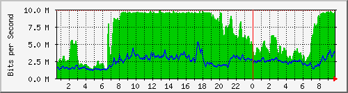
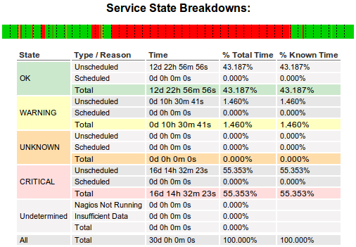
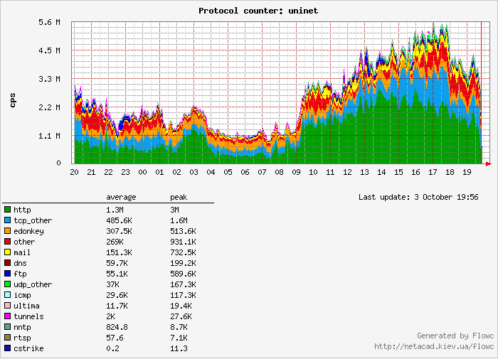
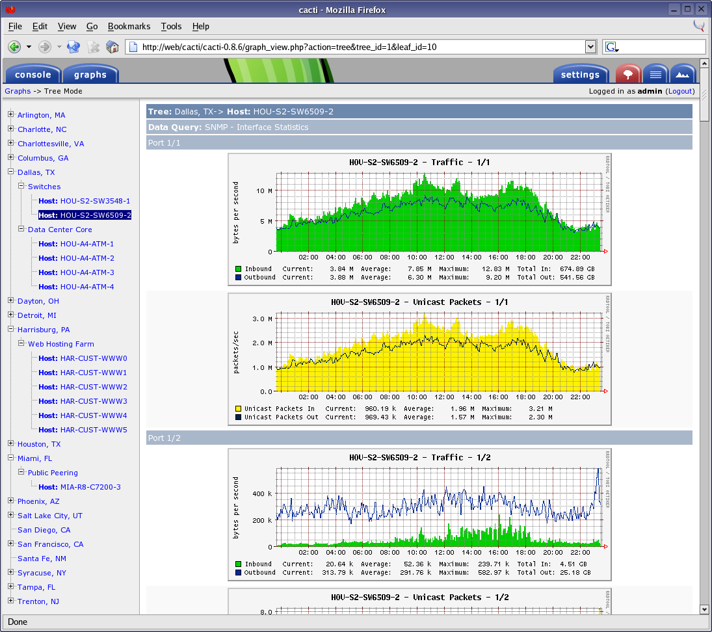
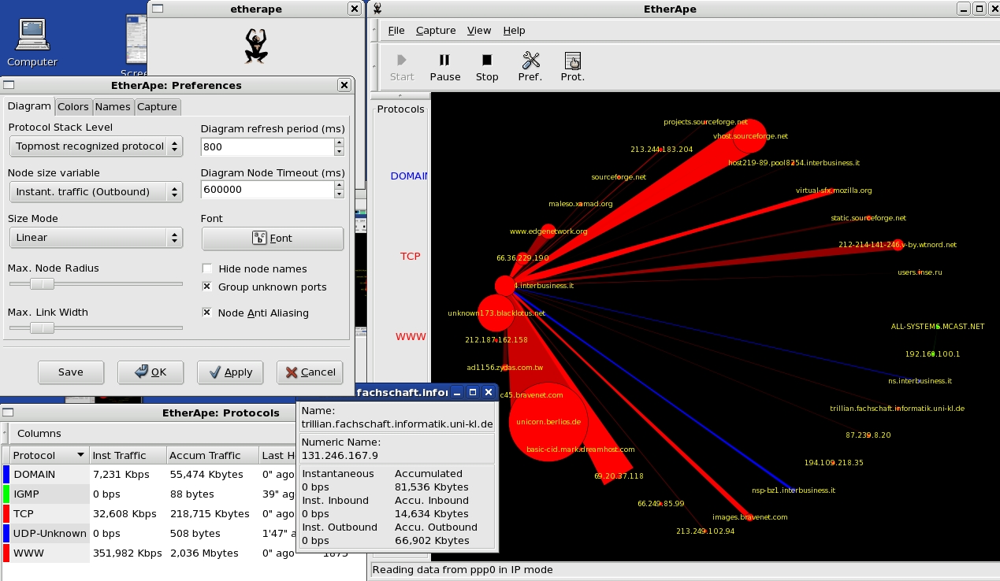
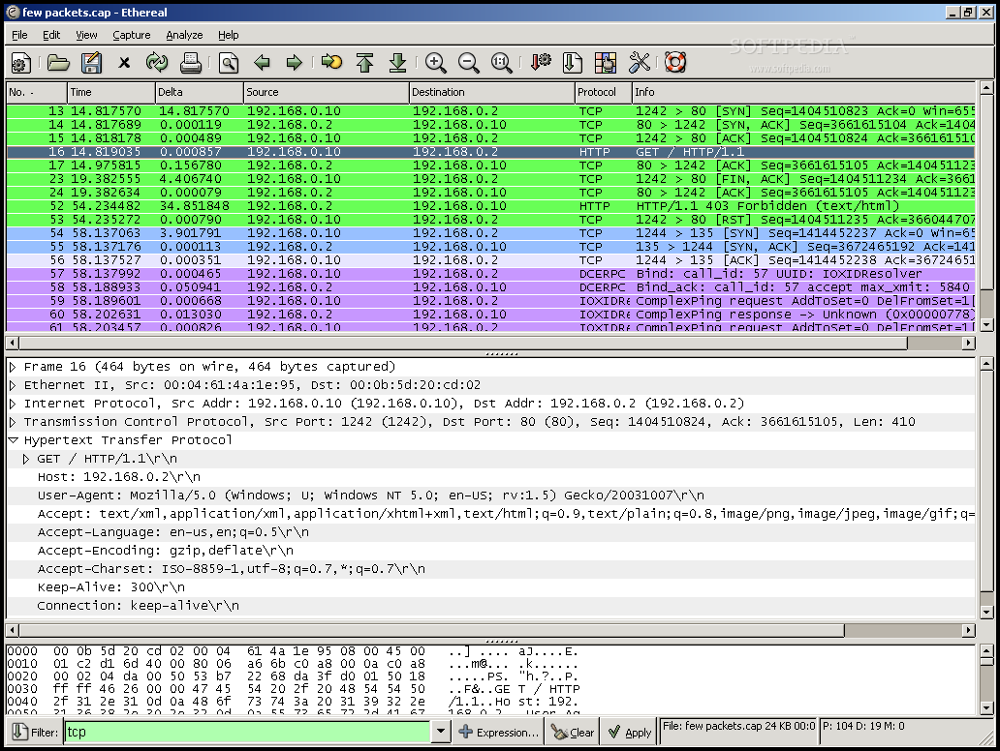
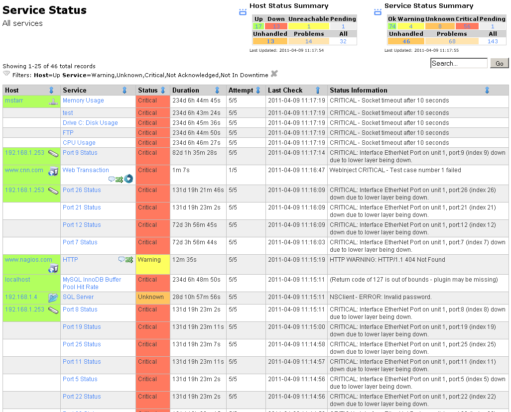

.. include:: <s5defs.txt>

.. include:: ../includes/Series.rst

Unit 7: Network Monitoring
==========================

.. include:: ../includes/Authors.rst

Objectives
----------

On completion of this session, we hope you will know about:

* Importance of monitoring in network management
* Why continuous traffic monitoring is important
* How network traffic monitoring is being done in representative institutions

Why Monitor?
------------

Do you have the information you need:

* Are getting what you paid for?
* Is it being used for the purpose intended?
* Is it being used efficiently?
* What will you need in future?
* Can you troubleshoot problems quickly?
* Can you enforce and improve the Acceptable Use Policy?
* Can you provide good service to users?

Group Discussion
----------------

If you are participating in a workshop, please discuss in groups:

* What sorts/aspects of traffic could be monitored?
* Why are those sorts/aspects of traffic monitoring important?
* Which does your institution monitor?
* What tools do you use? What works well or not?
* Have you found it of use? How and why?

When you have finished, please summarise your results to the other groups.

.. slide-layout:: 2column

Zimbabwe Example
----------------

-  Protocols
-  Dropped packets
-  IPs in use on LAN
-  P2P
-  Virus traffic
-  Hackers spoofing
-  SMTP (illegitimate mail)
-  Usage (who, what)

.. column:: 2

-  Applications using high bandwidth
-  Movies
-  Music
-  telnet
-  Voip/sip
-  Microsoft ds
-  Non business browsing
-  Amount of bandwidth (per user if poss)

Rwanda Example
--------------

* Protocols
* Dropped packets
* IPs in use on LAN
* P2P
* Virus traffic
* Amount of bandwidth (per user if poss)
* Hackers spoofing
* SMTP (illegitimate mail)
* Usage who what
* Applications using high bandwidth
* Movies
* Music
* telnet
* Voip/sip
* Microsoft ds
* Non business browsing

Are you getting what you paid for?
----------------------------------

You need to know:

*	Is it working at all? If not, when will it be fixed?
*	How much capacity you actually have, when you need it (all day?)
*	How much you are supposed to get (e.g. 100 Mbps with 10:1 contention?)

Do you need instant answers or long-term measurement?

.. class:: handout

Spot checks give an instant picture, but not complete. Automated monitoring
can give you a long-term picture, identify whether your service provider is
meeting their Service Level Agreement (SLA) with you, and help with trending
and fault-finding.

What can you measure?
---------------------

* Is the connection working at all?
	* Can you get traffic through it both ways?
	* Can you reach destinations on the Internet?
* How much traffic is passing in both directions?
	* *Traffic sizing* is a primary tool for first-line diagnosis of problems
* What kind of traffic is it?
	* Types of traffic and their size
	* Important for investigating and fixing congestion (over-use)

.. class:: handout

Checking whether the connection is working *right now* is relatively easy.
In Unit 6 we cover investigative techniques, using tools like *ping* and
*traceroute*, to check whether your connection is functioning at all, and
if so how fast/well.

Checking the total amount of traffic is also quite easy, if your border
router has built-in graphs of traffic use. If it supports SNMP, you can
also set up long-term monitoring and graphing quite easily, with tools
like *Cacti*.

Diving into traffic types, identifying the different streams and the volume of
traffic that they constitute, is hard, and requires knowledge of how TCP/IP
works, and how to use packet sniffing tools such as *tcpdump* or *wireshark*.
The information is too large to store and process at reasonable cost.
Capturing and using this information long-term requires you to be able to
compress it into a more useful form, such as flows, which requires knowledge
of tools that generate, store and process *Netflow* data, such as Cisco
routers, *pmacct*, *nfsen* and *argus*.

How much capacity do you have?
------------------------------

How can you monitor this long-term?

* Spot checks give an instant picture, but not complete.
* Automated monitoring helps with trending and fault-finding.

.. class:: handout

We covered how to measure speed instantaneously in Unit 6. But you want
a long-term solution, and manual speed tests take a lot of time. You can use
`Nagios`_ to check for contention at your ISP:

* packet loss
* latency
* available bandwidth (speed test)

You will get false alarms when your own connection is congested, so:

* either eliminate that (with careful bandwidth management), or
* subtract the percentage of time when the local connection is the problem.

You may want to measure other providers (collaborate with other universities?)
to see if they offer a better service.

Creating the Nagios service to measure bandwidth will require:

* An ``iperf`` server hosted on the Internet (don't know of a public one); or
* A public bandwidth testing server (maybe `Web100 <http://ndt.anl.gov:7123/>`_
  with adapted client?), or
* A large file downloaded with ``wget`` or ``ab`` (limited results)

TODO measure some data or use the GPRS benchmark data to show how to
monitor and interpret contention and congestion.

How is it being used?
---------------------

We need to analyse traffic on the connection:

* Is it being used for the purpose intended?
* Is it being used efficiently?

	Even if bandwidth is doubled, it will still need managing to ensure
	maximum efficiency

.. class:: handout

Otherwise, we won't know whether the organisation is getting value from their
investment in the Internet connection, nor argue for more funding for a faster
or more reliable connection.

Overall traffic level
---------------------

A good indicator of network health is lack of congestion.

Is this link congested? When and for how long?

.. class:: handout

This graph was generated by `MRTG <http://oss.oetiker.ch/mrtg/>`_,
collecting data from a router's SNMP counters or directly from the
interfaces.

The characteristic *flat top* between 0800 and 1900 on the graph
indicates that the network is fully utilised, which means it's very likely
to be congested. The graph cannot prove this, because it doesn't measure
latency, packet loss or available bandwidth (the signs of congestion; see
*Unit 6/Is my network congested?*).

Why is it likely to be congested? Normally a flat top means that at least
one TCP connection is running, since TCP tries to use all available
bandwidth. TCP keeps increasing its bandwidth use until packets start
dropping. This normally happens when the queue is full, so TCP normally
tries to fill up the link, causing congestion.

In practice there were probably hundreds or thousands of TCP flows active
between these times. The total amount downloaded is 10 Mbps (~1.25 MBps)
for 11 hours, which is ~50 GB. It's unlikely that one person was downloading
a single 50 GB file for the entire day!

Congestion questions
--------------------

Good questions to ask about network congestion:

* Is it happening?
* When is it happening?
* How bad is it? What are the consequences?
* What applications, protocols, servers and users are contributing to it?
* How busy (%) is the network on average, and during the periods of peak
  usage/congestion?

Group Discussion
----------------

What is your experience of congestion?

* Scope
* Regularity
* Impact
* Recoverability
* Prevention

.. class:: handout

If you are working in a group, please share your experience with the others.
If you are studying alone, please have a look at your network monitoring
systems, and try to identify congestion. Is your network congested right
now?

Long-term congestion reporting
------------------------------

   
   `Nagios`_ can generate congestion reports if properly configured.

.. class:: handout

If you configure `Nagios`_ to monitor your link for congestion, you can
generate reports showing how much of the time the network was congested for.
Some information on this is provided in the previous unit.

Solving congestion
------------------

* Congestion is not usually your ISP's fault!
	* unless it occurs in their network!
* Buy more bandwidth
* Optimise the efficiency of the circuit
* Reduce wasting of bandwidth (botnets, worms, packet loss)
* Charge by usage (tolls)
* Censor/block some websites or types of traffic
* Shift "undesirable" traffic out of business hours
* Limit the damage caused by undesirable traffic
* Need to understand (investigate) traffic patterns for all of this!
* How can you block/reduce popular traffic and not be blamed for it?

.. class:: handout

Affecting "popular" traffic (entertainment such as Facebook, YouTube and
other videos, sports and fashion websites) will always be unpopular. The
only ways to avoid being blamed are:

*	If people understand the higher good that is being served (faster
	Internet access for their work).
*	If the traffic is blocked or affected following a policy set by
	someone higher up (e.g. organisation management).

Traffic types
-------------

* What sort of content?
* Is size important ?
* Is quantity important?
* Is time important?
* Is it user or system traffic?
* Is it desirable traffic?

Levels of analysis
------------------

From least to most detail:

* Total traffic volumes
* Top talkers
* Applications (by port number)
* Applications (by deep packet inspection/DPI)
* Websites (by DPI or proxy server)
* Traffic flows (Netflow etc)
* Individual packets (pcap, Wireshark)

.. class:: handout

**Top talkers** are PCs, servers, and users generating the highest volumes
of network traffic based on IP or MAC address. If they are end users, they
are people you might want to have a word with. If they are servers, then
you need to know how much traffic is local (where there is plenty of
bandwidth) and how much is going over the scarce Internet link.

Some **applications** can be identified by port number. For example,
web sites and web services use HTTP, which is almost always on port 80 or
443, and thus easy to identify. Some applications such as *Skype* and
*Bittorrent* use many different ports or try hard not to be detected and
classified.

Because web traffic is so varied, you may need to investigate deeper into
which individual websites and types of content are being transferred, to
differentiate between preferred, commodity and undesirable traffic.

Breakdown of traffic
--------------------

Knowing the types of traffic on your network can answer some useful questions:

* Which servers and users are the top talkers
* What is the average utilization level
* When are your periods of highest and lowest utilization
* What effect is congestion having on critical business applications and user
  productivity
* What unauthorized applications are being used on the network
* How much recreational traffic is on the network
* Which users are consuming the most resources
* Which applications are consuming the most resources
* Are low-priority applications impacting core business applications?

Desirability of traffic
-----------------------

According to your Acceptable Use Policy (AUP), you should be able to
classify each stream as:

* Preferred/prioritised/institutionally important
* Politically necessary/expedient
* "Best effort" commodity traffic
* Undesirable
* Forbidden

.. class:: handout

Examples might include, depending on your AUP:

Preferred/prioritised/institutionally important traffic
	Journals, PDFs, external access to locally hosted web sites and email.
Politically necessary/expedient traffic
	Email, external webmail, search. May be important but not time critical;
	email can acceptably be delayed a few minutes.
"Best effort" commodity traffic
	Web sites that are not specifically academic.
Undesirable traffic
	Videos, media downloads.
Forbidden traffic
	P2P, viruses, spam, pornography.
	
Traffic classes
---------------

Those to protect others from:

* Top-uploaders (and repeat-offenders)
* Peer-to-peer applications

Those to protect from each other:

* Control
* Voice/Video/Streaming Media
* Academic TCP
* Residual ‘recreational’ TCP
* Non-TCP (ICMP? UDP? SIP?)

Monitoring traffic types
------------------------

In some cases you can identify whether the traffic is desirable just by
protocol.

Which of these traffic classes are desirable?

.. class:: handout

This graph was collected by the `Flowc netflow collector
<http://www.netacad.kiev.ua/flowc/index.php?id=1>`_, analysing data
collected by a Cisco router and sent to a monitoring station using the
`Netflow <http://en.wikipedia.org/wiki/NetFlow>`_ protocol.

Flowc provides an overview of the traffic, but cannot help you to break
down traffic by destination website (e.g. journals vs. YouTube) or
local client. Skype and HTTP traffic are difficult to identify using Netflow.
It also requires that you have a Cisco router, or another that can export
Netflow data.

`Argus <http://qosient.com/argus/visualization.shtml>`_ and
`NfSen <http://nfsen.sourceforge.net/>`_ allow you to perform more detailed
investigation into your network traffic, including *Top talkers* on your
local network. However they are difficult to use.

`pmGraph <http://www.aptivate.org/en/work/project-holder/pmgraph/>`_ also
allows such detailed analysis, and can collect data from a monitoring
station that is not a Cisco router. It's also designed to be easy to use
and powerful.

Institution Group Discussion
----------------------------

Of those traffic patterns outlined previously:

* What impact are they having on user satisfaction?
* What impact are they having on bandwidth utilisation?

Are these being monitored within your institution?

* With what technology?
* At what intervals?
* Is any action taken as a result of monitoring?
* If none is being used please discuss why this has happened (Time? Resources?
  Money?)

Some commercial monitoring tools
--------------------------------

There are `many tools <http://www.slac.stanford.edu/xorg/nmtf/nmtf-tools.html>`_
to be aware of, these are just a few:

* Agilent FireHunter
* Apparent Networks
* ixia IxChariot
* NetMon.ca
* Netscout Sniffer
* OPNET ACE
* PRTG
* Solar Winds
* Spirent SmartBits
* Various CISCO / 3COM / HP NMS tools

.. class:: handout

These are here just to show the range available, and to allow you after the
course to research their capabilities. You can then compare these against
your choice of no/low cost tools.

Some free monitoring tools
--------------------------

* Aguri
* Argus
* BandwidthD
* bwmon
* Cacti
* darkstat
* Etherape
* Flowscan
* ifTop
* Iperf
* Microsoft Network Monitor (netmon)
* MRTG
* Munin
* Nagios
* NeDi
* nfSen
* Ngrep
* NMAP
* Ntop
* OpenNMS
* pmacct/pmgraph
* Snort
* tcpdump
* Tele Traffic Tapper (ttt)
* Wireshark

TODO give detailed explanations and practical experience of all of these!

Free vs. commercial tools
-------------------------

Advantages of commercial tools:

* usually more features
* usually easier to use

Disadvantages:

* (more) expensive
* proprietary lock-in

Some shops refuse to use free tools; some refuse to use commercial.

Monitoring traffic levels
-------------------------

MRTG (Multi Router Traffic Grapher) is a tool to monitor the traffic load
on a network:

* Generates HTML with PNG reports
* Provides a LIVE (5 minutes old) visual representation of historic traffic
* Allows monitoring and analysis of many data centre functions (router,
  server, latency, utilization, temperature, etc.)
* Countless ways to utilize for data visualization

Monitoring routers and switches
-------------------------------

Cacti_ is an open source tool to monitor devices on the network via web
browser.

* Generates HTML with PNG reports
* Provides a live (5 minutes old) visual representation of historic traffic
* Allows monitoring and analysis of many data centre functions 
* Collect network port, CPU, latency, utilization, temperature, etc. using SNMP or scripts
* On the fly ability to magnify interesting graphs

.. class:: handout

You can download more information, exercises and worksheets for installing
and configuring Cacti on the
`AfNOG SSE <http://www.ws.afnog.org/afnog2011/sse/monitoring/>`_
course website, and many other places on the Internet.

Hosts and flows
---------------

`Etherape <http://etherape.sourceforge.net/>`_ is a graphical network
monitor for Unix:

* Network traffic is displayed graphically
* 'Top Talkers' indicated visually
* Select protocol stack of focus
* Network filters
* View internal traffic, end to end IP, or port to port TCP
* Can read saved tcpdump file
* Many protocols supported

Detailed host information
-------------------------

nTop collects and displays information about hosts, using a web interface:

Data sent/received
	The total traffic (volume and packets) generated or
	received by the host. Classified according to network protocol (IP, IPX,
	AppleTalk, etc.) and IP protocol (FTP, HTTP, NFS, etc.)
Used bandwidth
	Actual, average and peak bandwidth usage.
IP Multicast
	Total amount of multicast traffic generated or received by the host.
TCP sessions
	Currently active TCP sessions established/accepted by the host and
	associated traffic statistics.
UDP traffic
	Total amount of UDP traffic sorted by port.
TCP and UDP services used
	List of IP-based services (e.g. open and active ports)
	provided by the host with the list of the last five hosts that used them.
Traffic distribution
	Local traffic, local to remote traffic, remote to local traffic (local
	hosts are attached to the broadcast network).
IP traffic distribution
	UDP vs. TCP traffic, relative distribution of the IP protocols according
	to the host name.

Packet level analysis
---------------------

Wireshark is a *network protocol analyzer* (sniffer):

It shows exactly what is happening on your network, packet by packet.

* Examine data from a live network
* Examine saved capture file
* Supports many capture formats
* Reasonably intuitive interface
* View reconstructed TCP sessions
* Filters and graphs (not very easy to use!)

.. class:: handout

Wireshark captures, displays and analyses every packet that it's
configured to capture. Unfortunately this level of information can be
overwhelming. On a busy network (say 10 Mbps, fully utilised) there can be
10,000 or more packets per second!

Wireshark includes filters, so you can restrict the capture to certain
hosts or traffic types that interest you, and tools to break down traffic
by protocol, although they can be slow. You can also investigate which
website an individual connection is accessing, if you intercept the first
packets of the conversation.

This volume of data (~1 MB per second, 84 GB per day) is too much to store
and process in reasonable time, so this is only really useful as a
real-time diagnostic tool.

Service monitoring
------------------

Nagios_ is a network host and service monitor.

* Accessed via web browser
* Services (POP, PING, HTTP, etc)
* Host resources, Environmental factors
* Option of distributed monitoring
* Acknowledge issues via web interface
* Notification / event handlers
* Modular, allows for plug-ins

.. class:: handout

Nagios monitors hosts and services by regularly running *plugins* that
check the status. There are hundreds (perhaps thousands) of plugins for
common services, and it's easy to create new ones.

Nagios has a commercial version and several competitors, such as Zenoss,
Zabbix, OpenNMS and Hyperic. The competitors may be easier to use, but
Nagios is infinitely flexible, powerful and lightweight.

You can download more information, exercises and worksheets for installing
and configuring Nagios on the
`AfNOG SSE <http://www.ws.afnog.org/afnog2011/sse/monitoring/>`_
course website, and many other places on the Internet.

Network management framework
----------------------------

OpenNMS is a Network Management System framework.

Integrates "everything you need" for network management in one place.

.. class:: handout

Some people prefer a "one stop shop" that integrates many features in
one place. (This is counter to the Unix philosophy, where you have many
small, independent and flexible tools, making it easier to upgrade and
replace just one of them).

OpenNMS includes:

Action daemon
	Automated actions (work flows)
Collection daemon
	Collects data from various sources (SNMP, plugins, etc)
Capability daemon
	Capability check on nodes (for uptime reporting and alerting)
Discovery daemon
	Initial and ongoing discovery of services on the network (reduces need
	for manual configuration)
Events manager daemon
	Manages/stores events (changes in network and service status)
Notification daemon
	External notification of users (sends emails, SMS, electric shocks, etc)
Outage manager daemon
	Consolidates events (tries to avoid email storms during outages, when
	many services go down at one time)
Poller daemon
	Polls managed nodes/services
SNMP trap daemon
	Listens for SNMP traps (one of the biggest limitations of Nagios is that
	it doesn't have an SNMP trap listener)
Threshold daemon
	Monitor for threshold values and generate events/alerts

OpenNMS is big, and therefore heavy, and takes a while to learn your way
around.

Port scanning
-------------

Nmap is a utility for network exploration or security auditing. It detects
open ports (running services) on network hosts.

* Can rapidly scan large networks
* Detects application name and version (sometimes)
* Detects OS version
* Detects firewalls etc.
* Easy to use

Security auditing
-----------------

Nessus is a simple graphical tool which searched for common software
vulnerabilities over the network (remotely).

* Detects service on non-standard ports
* Will try to exploit remote service vulnerabilities
* Very up to date
* NASL (Nessus Attack Scripting Language)
* Client-server architecture
* Can test multiple host simultaneously
* Exportable reports in multiple formats

Intrusion Detection
-------------------

Snort is an open source Intrusion Detection System (IDS):

* Real-time traffic analysis/alerts
* Packet logging
* Protocol analysis
* Content searching/matching
* Detect attacks/probes
* Flexible rules language
* Web console
* Mature

Institution Group Discussion
----------------------------

Experience of these products:

* Which have been used within institution?
* Do you have experience of any others?
* Are these being monitored within your institution?

Technically of these products:

* Which APPEAR to be a solution to monitoring needs?
* Why?

Plenary Discussion
------------------

* Shared experience of those products
* Technically of  those products, which APPEAR to be a solution to most
  monitoring needs? Why?

Open-source versus proprietary products
---------------------------------------

* Balance cost and capabilities:
* Limitations:
	* Money
	* Skills
	* Resources
	* Equipment
	* Processes
* Opportunities
	* Optimise bandwidth
	* Gain experience
	* Share experience

Evaluation Criteria
-------------------

* Learning Curve
	* Skills
	* Equipment
	* Shared experience
* Capabilities
	* Point solution
	* Quick Fix
	* Breadth
	* Integration

Conclusion
----------

What have we learnt about solutions?

* Reviewed some technology solutions for network traffic monitoring
* Identified key products to monitor/graph the top five traffic patterns
* Been able to choose between cost effectiveness of open-source versus (perhaps)
  more functional proprietary solutions
* Gained an insight into looking for such products and making value based
  judgments on future products.
