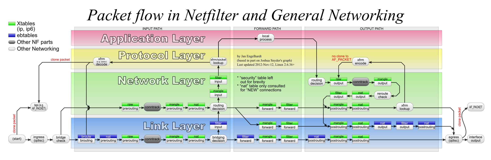

.. include:: <s5defs.txt>

.. include:: ../includes/Series.rst

Unit 9: Making a Difference
===========================

.. include:: ../includes/Authors.rst

Planning
--------

US President Dwight D. Eisenhower once said:

	I have always found that plans are useless but planning is indispensable.

Things you might want to plan for:

* Monitoring to establish baselines
* Detecting and responding to performance changes
* Disaster recovery
* Professional development through reflection
* Revising your plans as you discover new things

Don't forget:

* Who needs to be involved
* Who will it affect
* How to win their support
* When and how to review and improve the plan

Recovering from problems
------------------------

* Identify problem
	* Alarm system trigger
	* Abnormal activity
	* User complaints
* Contain problem
	* Localise the problem to some service, network branch, etc.
	* Prevent the problem from spreading if necessary
	* Isolate the segment or device(s) causing the problem
	* Diagnose problem and fix
* Test the resolution
	* Change monitoring level temporarily to reduce noise?
	* Reintroduce device(s) to network
	* Compare monitoring to baseline in real-time
* Learn from the problem
	* Identify process to reduce risk of reoccurrence or reduce severity
	* See Unit 4, Section 7 (How do we mitigate faults?) for details

Solving bandwidth problems
--------------------------

If available bandwidth is the main problem:

* slow page loading
* slow downloads
* high latency or packet loss
* connection is full

Then you need to increase *supply* of bandwidth and/or reduce *demand*.

* Congestion is not usually your ISP's fault!
	* unless it occurs in their network!

Solving congestion problems
---------------------------

* Reduce waste (botnets, worms, updates, packet loss)
* Buy more bandwidth
* Optimise the efficiency of the circuit
* Charge by usage (tolls)
* Censor/block some websites or types of traffic
* Shift "undesirable" traffic out of business hours
* Limit the damage caused by undesirable traffic
* Need to understand (investigate) traffic patterns for all of this!
* How can you block/reduce popular traffic and not be blamed for it?

.. class:: handout

Affecting "popular" traffic (entertainment such as Facebook, YouTube and
other videos, sports and fashion websites) will always be unpopular. The
only ways to avoid being blamed are:

* If people understand the higher good that is being served (faster
  Internet access for their work).
* If the traffic is blocked or affected following a policy set by
  someone higher up (e.g. organisation management).
* If you have no choice, for example it is blocked by your ISP.

Better management of existing resources
---------------------------------------

Optimisation to ensure value for money and fitness of purpose. For example:

* Monitoring of bandwidth to know how it is being used
* Implementation of policies to guide effective use
* Technical tools and resources to optimise use

Different people need to be involved in this:

* Executive management
* Senior implementation management
* Technical staff involved in the day-to-day implementation

Reducing waste of bandwidth
---------------------------

* Can make a big difference
	* Use monitoring to identify whether it's needed or not
* Often provides a basis for further action
* Almost never a complete solution
* What kind of technical issues?

Examples of reducing waste
--------------------------

* House-keeping
	* Microsoft updates, virus definition files, automated patches of all kinds
* Spam, virus and worm outbreaks
	* valueless traffic that might be eating bandwidth
* Caching
	* DNS caching can make a huge difference to page loading speed
	* web caching can speed up some pages, and reduce bandwidth use by 40%

Monetary Options
----------------

* Buy more bandwidth
* Charge for bandwidth used

Buying more bandwidth
---------------------

May be difficult:

* Expensive
* Often only a short-term solution
* Can make things worse (encourage bad behaviour)
* Important to benchmark costs
* How can you justify the cost?

Perhaps the only way to justify the cost is to show that it's **all**
being used for the intended purpose, which requires monitoring.

Charging for bandwidth used
---------------------------

Controversial:

* Very effective at dampening demand
* Can fund growth of the circuit
* *Highly damaging* to educational and research objectives
* Requires monitoring to know how much each person/department has used.

Perhaps the only way to justify the bill is to show *what* traffic each
department has caused to incur the bill, which requires monitoring.

Other incentives for good behaviour
-----------------------------------

* Understand how your connection is being used (requires monitoring)
* Try to change user behaviour (requires policy)
* Empower users to diagnose and understand network problems
	* Recruits users onto your side!

Empowering users
----------------

* You could call these users "Guard Dogs"
* Give them tools and knowledge to identify if network is really broken
	* Provides a sense of empowerment
	* Local departmental resource
	* Campus, Link, national, international
	* Even if they don’t understand what it means
	* Even if they cannot contact an admin
* For example: access to Nagios, service status page, basic diagnostic software.
	* Needs to be appropriate to users' level of understanding and desire to
	  help.

Affecting users
---------------

Make sure an apparent network problem effects your Chancellor/Vice Chancellor !!

* This is a risky strategy! Will it work? How?

.. class:: handout

* Will we lose our jobs if we don't give the senior executives special treatment?
* Will we be able to fix the problems quickly enough to keep our jobs?

Monitoring summary
------------------

You need to monitor in detail to:

* Justify an increase in capacity (expense)
* Bill users or departments for their usage
* Inform policy development and maintenance
* Enforce policy (however softly)
* Check whether your changes are having the desired effect

Would you build a building with your eyes closed?

.. class:: handout

Basically you *must* monitor the use of your connection in detail. There
is no excuse or alternative.

Changing user behaviour
-----------------------

Change in behaviour must be *voluntary*.

* You need an Acceptable Use Policy (AUP);
* It must allow you to take some kind of action (including monitoring);
* All users must have read it, and agreed to follow it.
	* They must understand how and why it benefits them to follow it.
* It must be fairly and consistently used (enforced).

Otherwise, the users will be fighting against you instead of for you. And
there are more of them.

Policy health warning
---------------------

If you take action *without* a policy, who is responsible for the
consequences?

If you take action *within* a policy, who is responsible?

It's much safer to follow a policy! See Unit 10 for assistance with policy
development.

Behaviour changing tactics
--------------------------

* Give users feedback about how much bandwidth they're using.
* Give each users a limited bandwidth quota.
* Ensure that abusive users hurt themselves, not others.
* Engage with highest bandwidth users.
	* "Have a chat" with them, or name and shame them
* Block or deter access to some sites or services.

Which of these require monitoring to implement them?

.. class:: handout

All of these require monitoring, except "Ensure that abusive users hurt
themselves, not others" which can be automatic.

Blocking access to resources
----------------------------

* Unpopular with users
	* They want Facebook and Youtube!
* Least preferred option!
	* But technically easiest.
* How much impact will it have?
	* Is it worth the cost?
* Reduce bandwidth available at peak times instead of blocking?

Actually blocking access to resources
-------------------------------------

* Block by protocol
	* But you can't really block all websites (port 80 and 443)
* Block by IP address
	* IP addresses change, e.g. Facebook, Google, Dropbox
	* Normally done on a firewall using a packet filter
* Block by hostname
	* Requires intercepting HTTP proxy (or DNS tricks)
	* Can sometimes be evaded by using IP address instead of hostname

Both blocking by IP and by hostname can be evaded using proxy servers,
VPN tunnels.

Alternatives to blocking
------------------------

Because blocking is so unpopular, you may wish to:

* Reduce speed instead of blocking
* Offer an alternative such as a "commodity" wireless network, with less
  bandwidth allocated to it, or mobile dongles
* Allow during certain hours, e.g. out of business hours

Technical solutions
-------------------

* Technical optimisation
	* Critically important
	* Often provides a basis for further action
	* Almost never the complete solution
* Control/Censor
	* Technically possible
	* Policy driven, Political
* Benchmark (continually)
* Monitor (continually)
* Audit (frequently)

Packet filtering
----------------

Depending where you want to apply the filtering:

* On a Cisco router: use Cisco ACLs.
* On a Linux transparent bridge or firewall: use iptables.
* On a FreeBSD transparent bridge or firewall: use ipfw or pf.
* On a Windows firewall: use Microsoft ISA Server.

TODO: describe Cisco ACLs and FreeBSD firewalls.

iptables
--------

* Multiple tables (nat, filter, mangle)
* Multiple chains in each table (INPUT, FORWARD, OUTPUT)
* Rules live in a table and chain (e.g. filter FORWARD)
* Each rule contains a match (e.g. protocol, port) and a target (action)
* Each matching rule applied in turn
* Some targets are terminating (ACCEPT, DROP), others are not (LOG)
* First rule applied with a terminating target ends processing for that packet.

Example iptables rule to block all port 8080 traffic::

	iptables -t filter -A FORWARD -p tcp --dport 8080 -j DROP

Blocking websites
-----------------

You can use DansGuardian as a web proxy to block all pages containing certain keywords:

* http://www.sussex.ac.uk
* http://www.expertsexchange.com
* http://196.21.99.105/archive/img097.jpg

.. class:: handout

The first two would be blocked if you blocked all URLs that contain "sex".

The third is an example where you have no way of knowing what the image contains.
